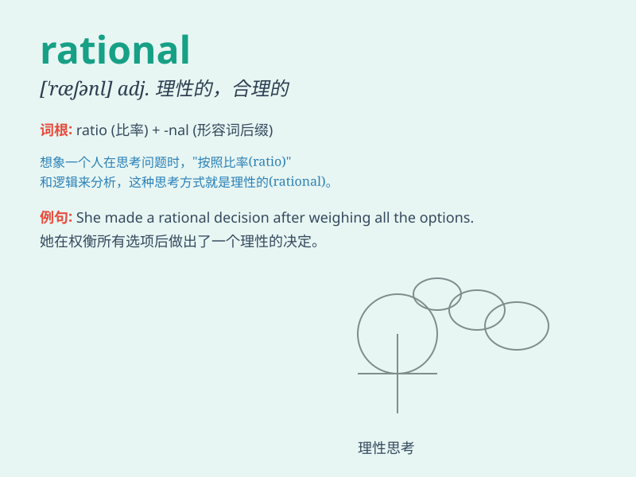

## rational

**英音:** _[\'ræʃ(ə)n(ə)l]_ **美音:** _[\'ræʃnəl]_

**译义:** *adj.理性的,合理的,推理的n.[数]有理数*

### 短语

+ **rational thinking:** _理性思考_

+ **rational decision:** _合理的决定_

+ **rational behavior:** _理性行为_

+ **rational choice:** _理性选择_

+ **rational explanation:** _合理的解释_

### 例句

#### 例句1

> **She made a rational decision based on careful consideration.**

**中文翻译:** 她经过仔细考虑做出了一个理性的决定。

**单词释义:** 理性的

#### 例句2

> **His argument was quite rational and hard to refute.**

**中文翻译:** 他的论点相当合理，难以反驳。

**单词释义:** 合理的

#### 例句3

> **It\'s not rational to get angry over such a small matter.**

**中文翻译:** 为这么一件小事生气是不理智的。

**单词释义:** 理智的

### 背诵小故事

> A king was often driven by emotions. One day, he met a wise man who
taught him to be rational. The king started to think logically before
making decisions and his kingdom became prosperous. Remember, rational
means logical and reasonable.

**一位国王常常被情绪左右。有一天，他遇到了一位智者，智者教导他要理性。国王开始在做决定前进行逻辑思考，他的王国变得繁荣起来。记住，rational
意思是有逻辑的、合理的。**

### 图义

