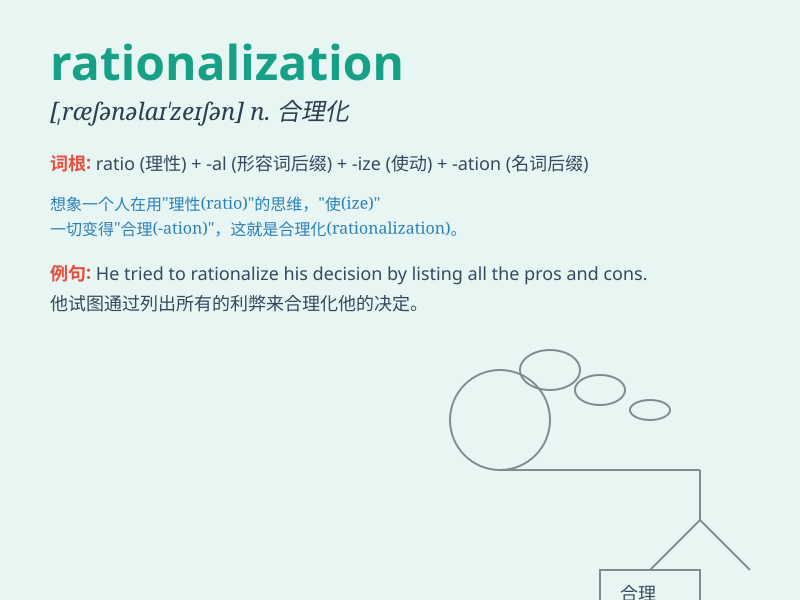

## rationalization

**英音:** _[,ræʃənəlaɪ\'zeɪʃən]_ **美音:**
_[,ræʃənəlɪ\'zeʃən]_

**译义:** *n.合理化,合于经济原则*

### 短语

+ **rationalization process:** _合理化过程_

+ **economic rationalization:** _经济合理化_

+ **rationalization proposal:** _合理化建议_

+ **industrial rationalization:** _工业合理化_

+ **rationalization of production:** _生产合理化_

### 例句

#### 例句1

> **The rationalization of the production process led to increased
efficiency.**

**中文翻译:** 生产过程的合理化导致了效率的提高。

**单词释义:** 合理化

#### 例句2

> **He tried to offer a rationalization for his bad behavior.**

**中文翻译:** 他试图为他的不良行为提供一个合理化的解释。

**单词释义:** 合理化的解释

#### 例句3

> **The company\'s rationalization program involved cutting jobs.**

**中文翻译:** 公司的合理化方案涉及裁员。

**单词释义:** 合理化方案

### 背诵小故事

> A factory was in chaos until the smart manager came up with
rationalization plans. He analyzed problems logically, made efficient
decisions, and finally turned the factory around. The process was called
rationalization.

**一家工厂陷入混乱，直到聪明的经理提出合理化计划。他逻辑地分析问题，做出高效的决策，最终使工厂扭亏为盈。这个过程被称为合理化。**

### 图义

