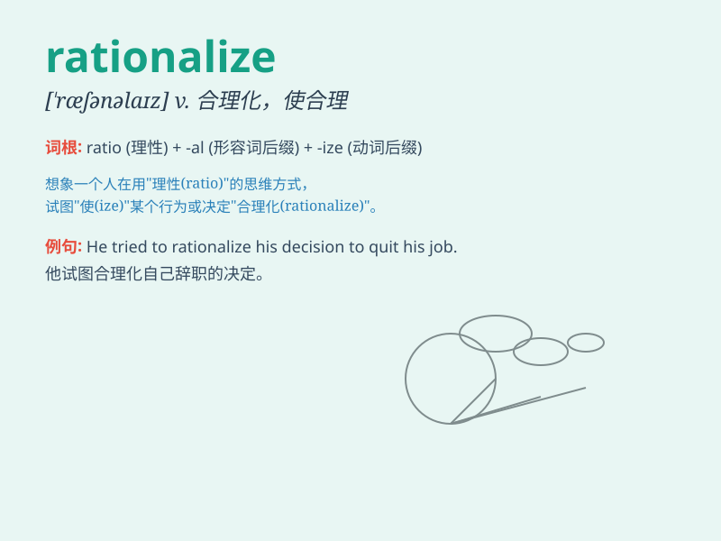

## rationalize

**英音:** _[ˈræʃnəlaɪz]_ **美音:** _[ˈræʃnəlaɪz]_

**译义:** *v.合理化*

### 短语

+ **rationalize the management:** _使管理合理化_

+ **rationalize production:** _使生产合理化_

+ **rationalize the process:** _使流程合理化_

+ **rationalize one\'s behavior:** _为某人的行为找理由_

+ **rationalize the decision:** _使决定合理化_

### 例句

#### 例句1

> **The company tried to rationalize its production process to reduce
costs.**

**中文翻译:** 这家公司试图使其生产流程合理化以降低成本。

**单词释义:** 使合理化

#### 例句2

> **He rationalized his decision to quit his job by saying he needed
a change.**

**中文翻译:** 他为自己辞职的决定辩解，说自己需要改变。

**单词释义:** 为...辩解

#### 例句3

> **She found it difficult to rationalize her fear of flying.**

**中文翻译:** 她发现很难为自己对飞行的恐惧找到合理的解释。

**单词释义:** 对...进行合理的解释

### 背诵小故事

> A factory owner was accused of overworking his staff. To defend
himself, he tried to rationalize his actions by saying it was for the
company\'s growth. But in reality, it was just an excuse to avoid
criticism.

**一位工厂老板被指责让员工过度工作。为了给自己辩解，他试图把自己的行为合理化，说这是为了公司的发展。但实际上，这只是逃避批评的借口。**

### 图义

