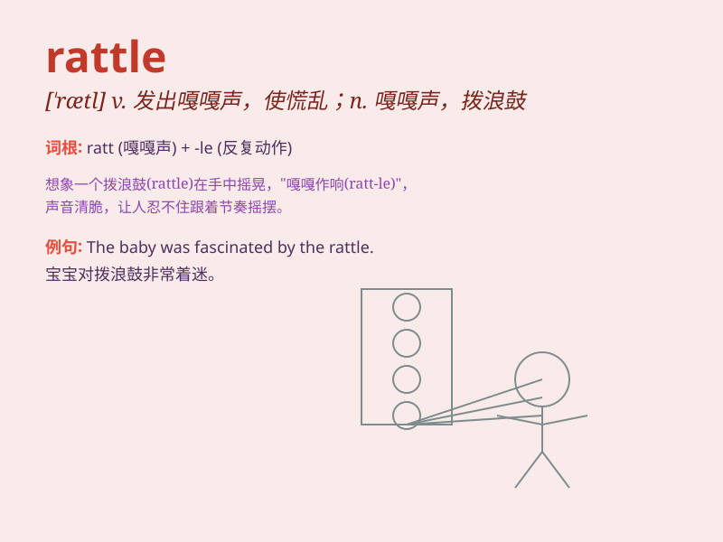

## rattle

**英音:** _[\'ræt(ə)l]_ **美音:** _[\'rætl]_

**译义:**
*v.发出卡嗒卡嗒声,喋喋不休,急忙地做n.吓吱声,喋喋不休的人*

### 短语

+ **rattle off:** _快速而流利地说出_

+ **rattle around:** _在（大的空间）里晃荡；闲置不用_

+ **rattle through:** _迅速完成_

+ **rattle something out:** _急促地说出某事_

+ **rattle one\'s cage:** _激怒某人；打扰某人_

### 例句

#### 例句1

> **The baby was rattling a toy in her hand.**

**中文翻译:** 婴儿正在把她手里的玩具弄得格格作响。

**单词释义:** 使发出连续短促的碰撞声

#### 例句2

> **The train rattled along the tracks.**

**中文翻译:** 火车沿着铁轨嘎嘎作响。

**单词释义:** （车辆）哐啷哐啷地行驶

#### 例句3

> **The wind rattled the windows.**

**中文翻译:** 风吹得窗户嘎嘎作响。

**单词释义:** 使（物体）发出嘎嘎声

### 背诵小故事

> A little mouse was running in the old house, making the bottles
rattle. The sound of the rattle scared the cat away. Remember,
\'rattle\' means to make a rapid succession of short sharp noises.

**一只小老鼠在老房子里跑，让瓶子发出嘎嘎声。嘎嘎声把猫吓跑了。记住，\'rattle\'意思是发出连续短促的尖锐声音。**

### 图义

