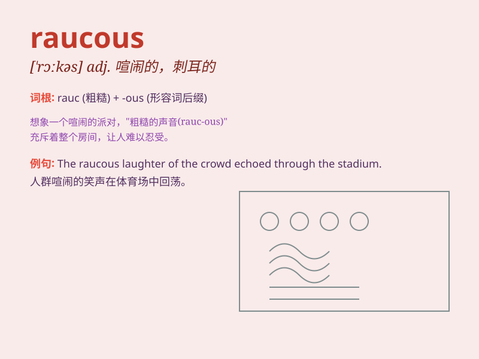

## raucous

**英音:** _[\'rɔːkəs]_ **美音:** _[\'rɔkəs]_

**译义:** *adj.沙哑的*

### 短语

+ **raucous laughter:** _沙哑的笑声_

+ **raucous crowd:** _喧闹的人群_

+ **raucous party:** _吵闹的聚会_

+ **raucous music:** _刺耳的音乐_

+ **raucous voice:** _粗哑的嗓音_

### 例句

#### 例句1

> **The raucous party next door kept me awake all night.**

**中文翻译:** 隔壁喧闹的聚会让我彻夜难眠。

**单词释义:** 喧闹的

#### 例句2

> **The raucous crowd at the football game was in high spirits.**

**中文翻译:** 足球比赛中喧闹的人群情绪高昂。

**单词释义:** 喧闹的

#### 例句3

> **His raucous laughter filled the room.**

**中文翻译:** 他沙哑的笑声充满了整个房间。

**单词释义:** 沙哑刺耳的

### 背诵小故事

> In a wild party, the music was so raucous that it made people\'s ears
ring. The guests were shouting and laughing loudly, creating a chaotic
and noisy scene. It was a truly raucous gathering.

**在一个狂野的派对上，音乐非常喧闹，以至于人们的耳朵嗡嗡作响。客人们大声喊叫和大笑，营造出一片混乱嘈杂的景象。这真是一场喧闹的聚会。**

### 图义

