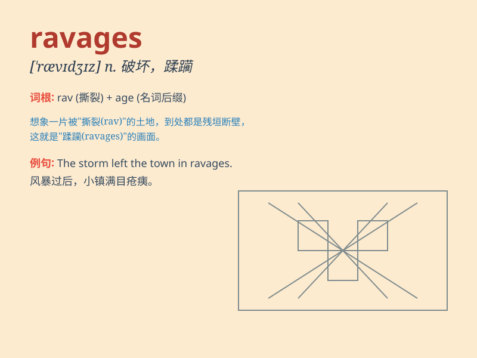

## ravages

**英音:** _[ˈrævɪdʒɪz]_ **美音:** _[ˈrævɪdʒɪz]_

**译义:**
*n.破坏，蹂躏（ravage的复数形式）；v.破坏，蹂躏（ravage的第三人称单数形式）*

### 短语

+ **the ravages of time:** _时间的摧残_

+ **ravages of war:** _战争的破坏_

+ **the ravages of disease:** _疾病的蹂躏_

+ **ravages of nature:** _大自然的肆虐_

+ **the ravages of fire:** _火灾的毁坏_

### 例句

#### 例句1

> **The ravages of war left the city in ruins.**

**中文翻译:** 战争的破坏使这座城市成为一片废墟。

**单词释义:** 破坏；毁坏

#### 例句2

> **The disease has caused the ravages to his health.**

**中文翻译:** 这种疾病对他的健康造成了损害。

**单词释义:** 损害；伤害

#### 例句3

> **The storm\'s ravages were visible everywhere.**

**中文翻译:** 风暴的肆虐随处可见。

**单词释义:** 肆虐；摧残

### 背诵小故事

> A fierce storm brought the ravages to the small town. Trees were
uprooted, houses damaged. It looked like a monster had been here,
leaving chaos everywhere. But people united to repair and recover from
the ravages.

**一场猛烈的风暴给这个小镇带来了破坏。树木被连根拔起，房屋受损。看起来就像有个怪物来过，到处一片混乱。但人们团结起来，从这些破坏中进行修复和恢复。**

### 图义

