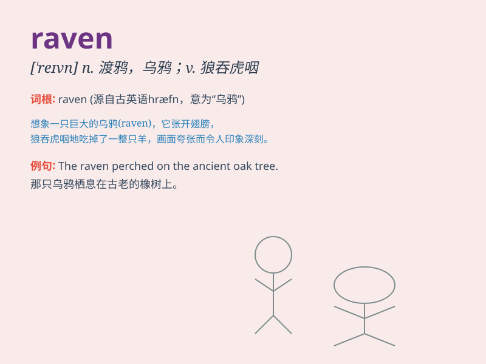

## raven

**英音:** _[\'reɪv(ə)n]_ **美音:** _[\'revən]_

**译义:** *n.大乌鸦,掠夺adj.乌黑的v.掠夺,狼吞虎咽*

### 短语

+ **raven hair:** _乌黑的头发_

+ **raven black:** _乌黑的；漆黑的_

+ **raven wing:** _乌鸦的翅膀_

+ **raven cry:** _乌鸦的叫声_

+ **raven flock:** _乌鸦群_

### 例句

#### 例句1

> **The raven perched on the branch of the old tree.**

**中文翻译:** 乌鸦停在老树的树枝上。

**单词释义:** 乌鸦

#### 例句2

> **She has raven black hair that shines in the sunlight.**

**中文翻译:** 她有一头乌黑的头发，在阳光下闪闪发亮。

**单词释义:** 乌黑的

#### 例句3

> **The poet described the raven as a symbol of mystery.**

**中文翻译:** 诗人将乌鸦描述为神秘的象征。

**单词释义:** 乌鸦

### 背诵小故事

> A raven was lost in a big forest. It flew around, looking for its way
home. Finally, with its smart eyes and strong wings, it found the right
direction. The raven was so happy!

**一只乌鸦在一片大森林里迷路了。它到处飞，寻找回家的路。最后，凭借着它聪明的眼睛和强壮的翅膀，它找到了正确的方向。这只乌鸦非常高兴！**

### 图义

