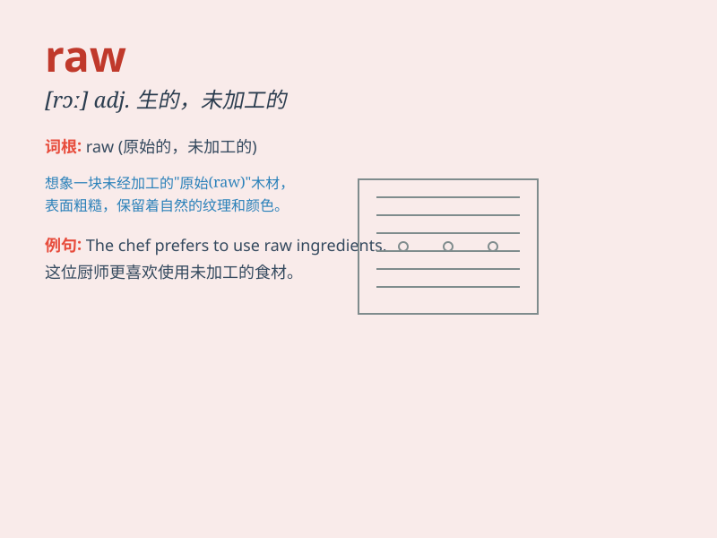

## raw

**英音:** _[rɔː]_ **美音:** _[rɔ]_

**译义:**
*n.生肉,擦伤处,身上的痛处adj.未加工的,生疏的,处于自然状态的,,不掺水的,擦掉皮的,阴冷的,刺痛的vt.擦伤*

### 短语

+ **raw material:** _原材料；原料_

+ **raw data:** _原始数据；原始资料_

+ **in the raw:** _处于自然状态；裸体；质朴的_

+ **raw meat:** _生肉_

+ **raw deal:** _不公平的待遇；苛刻的待遇_

### 例句

#### 例句1

> **The raw materials for this product are imported from abroad.**

**中文翻译:** 本产品的原材料均从国外进口。

**单词释义:** 未加工的；原始的（指材料）

#### 例句2

> **She has a raw talent for music.**

**中文翻译:** 她有着与生俱来的音乐天赋。

**单词释义:** 天生的；未经训练的（指才能）

#### 例句3

> **His skin was raw from the sunburn.**

**中文翻译:** 他的皮肤被晒伤了。

**单词释义:** 红肿疼痛的；擦伤的（指皮肤）

### 背诵小故事

> A chef was cooking. He got some raw meat and needed to cook it. But
he accidentally touched the raw meat with his bare hand. Now he had to
wash his hands carefully.

**一位厨师正在做饭。他得到了一些生肉，需要烹饪它。但他不小心用裸手碰到了生肉。现在他得仔细洗手。**

### 图义

