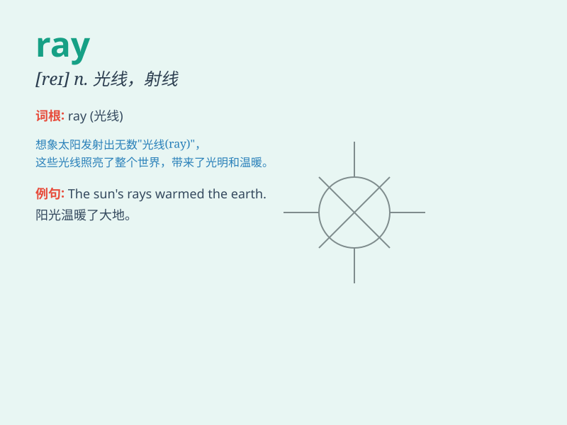

## ray

**英音:** _[reɪ]_ **美音:** _[re]_

**译义:** *n.光线,闪烁,微量vi.射出光线,浮现,放射光线vt.放射,显出*

### 短语

+ **cosmic ray:** _宇宙射线_

+ **x-ray:** _X 射线；光机；X 光照片_

+ **ray of hope:** _一线希望_

+ **ultraviolet ray:** _紫外线_

+ **infrared ray:** _红外线_

### 例句

#### 例句1

> **The sun\'s rays shone through the clouds.**

**中文翻译:** 阳光透过云层照射进来。

**单词释义:** 光线

#### 例句2

> **A ray of hope emerged in the difficult situation.**

**中文翻译:** 困境中出现了一线希望。

**单词释义:** 一线（希望）

#### 例句3

> **The x-ray showed that her bone was broken.**

**中文翻译:** X光检查显示她的骨头骨折了。

**单词释义:** 射线

### 背诵小故事

> A little fish was lost in the deep sea. Suddenly, a ray of light
shone through, guiding it home. The light was like a magical ray,
showing the way. So, remember \'ray\' means a beam of light.

**一条小鱼在深海中迷路了。突然，一束光线射进来，引导它回家。这束光就像神奇的光线。所以，记住\'ray\'意思是光线。**

### 图义

