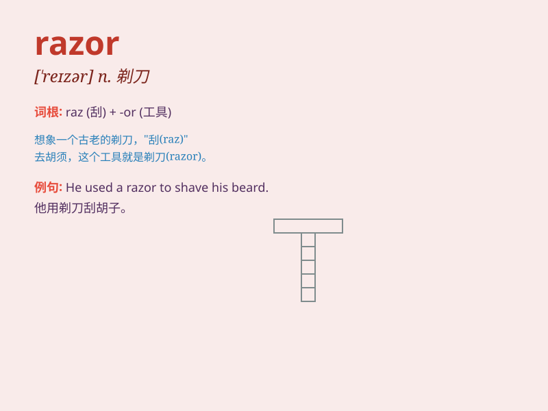

## razor

**英音:** _[\'reɪzə]_ **美音:** _[\'rezɚ]_

**译义:** *n.剃刀vt.剃*

### 短语

+ **electric razor:** _电动剃须刀_

+ **safety razor:** _安全剃刀_

+ **razor blade:** _剃须刀片_

+ **straight razor:** _直剃刀_

+ **razor wire:** _铁丝网；带刺铁丝网_

### 例句

#### 例句1

> **He shaved with a new razor this morning.**

**中文翻译:** 今天早上他用一把新剃须刀刮胡子。

**单词释义:** 剃须刀

#### 例句2

> **The edge of the razor is very sharp.**

**中文翻译:** 剃须刀的边缘非常锋利。

**单词释义:** 剃须刀

#### 例句3

> **She used a razor to trim the hair on her legs.**

**中文翻译:** 她用剃刀修剪腿上的毛发。

**单词释义:** 剃刀

### 背诵小故事

> One day, Tom was in a hurry to shave and found his razor was not
sharp. He had to rush to the store to buy a new one. With the new razor,
he had a clean shave and felt refreshed.

**一天，汤姆着急刮胡子，发现他的剃须刀不锋利了。他不得不匆忙去商店买一个新的。用新的剃须刀，他刮得干干净净，感觉神清气爽。**

### 图义

