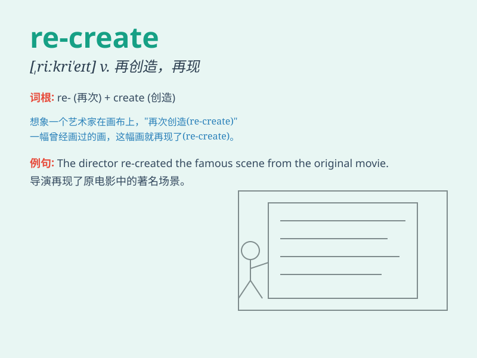

## re-create

**英音:** _[ˌriːkriˈeɪt]_ **美音:** _[ˌriːkriˈeɪt]_

**译义:** *vt. 再创造；重新创造；复制；再现*

### 短语

+ **re-create an atmosphere:** _重新营造一种氛围_

+ **re-create a scene:** _重现一个场景_

+ **re-create a situation:** _重新创造一种状况_

+ **re-create an image:** _重塑一个形象_

+ **re-create a memory:** _重新唤起一段记忆_

### 例句

#### 例句1

> **The artist decided to re-create the famous painting with a modern
twist.**

**中文翻译:** 这位艺术家决定以现代的手法重新创作这幅著名的画作。

**单词释义:** 重新创作

#### 例句2

> **They are trying to re-create the atmosphere of an old-fashioned
village fair.**

**中文翻译:** 他们正试图重新营造出一个老式乡村集市的氛围。

**单词释义:** 重新营造

#### 例句3

> **The company aims to re-create its past success by launching a new
product line.**

**中文翻译:** 该公司旨在通过推出新的产品线来重新创造过去的成功。

**单词释义:** 重新创造

### 背诵小故事

> A famous artist lost all his paintings in a fire. But with strong
will, he decided to re-create them. He spent days and nights working
hard, and finally, the wonderful artworks were re-created and even
better than before.

**一位著名的艺术家在一场火灾中失去了他所有的画作。但凭借坚强的意志，他决定重新创作它们。他日夜努力工作，最终，这些精彩的艺术品被重新创作出来，甚至比以前更好。**

### 图义

