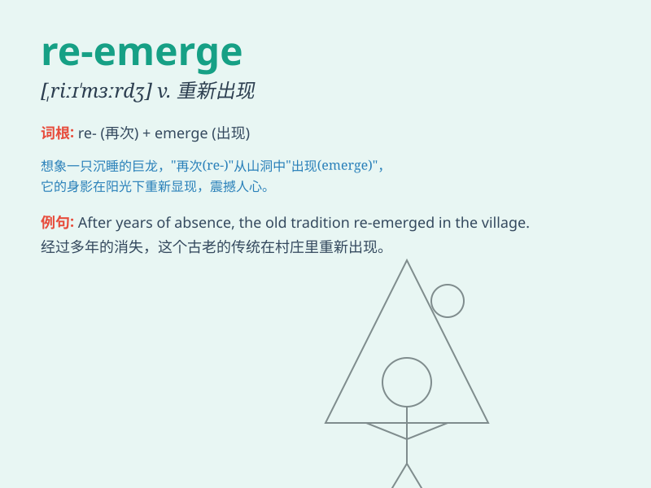

## re-emerge

**英音:** _[ˌriːɪˈmɜːdʒ]_ **美音:** _[ˌriːɪˈmɜːrdʒ]_

**译义:** *vi.重新出现；再次浮现*

### 短语

+ **re-emerge from:** _从\...\...中重新出现_

+ **re-emerge after:** _在\...\...之后重新出现_

+ **re-emerge in:** _在\...\...中重新出现_

+ **re-emerge into:** _重新出现在\...\...里_

+ **re-emerge with:** _带着\...\...重新出现_

### 例句

#### 例句1

> **After years of obscurity, the band re-emerged with a new
album.**

**中文翻译:** 在默默无闻多年之后，这个乐队带着一张新专辑重新出现。

**单词释义:** 重新出现

#### 例句2

> **The old problem re-emerged when they least expected it.**

**中文翻译:** 这个老问题在他们最意想不到的时候又重新出现了。

**单词释义:** 重新出现

#### 例句3

> **The fashion trend of the 80s has re-emerged in recent years.**

**中文翻译:** 80 年代的时尚潮流近年来又重新出现了。

**单词释义:** 重新出现

### 背诵小故事

> A beautiful butterfly went into a cocoon. After a long time, it
re-emerged as an even more splendid creature, spreading its wings and
flying freely in the garden.

**一只美丽的蝴蝶进入了茧中。过了很长时间，它重新出现，变成了一只更加绚丽的生物，在花园里展翅自由飞翔。**

### 图义

