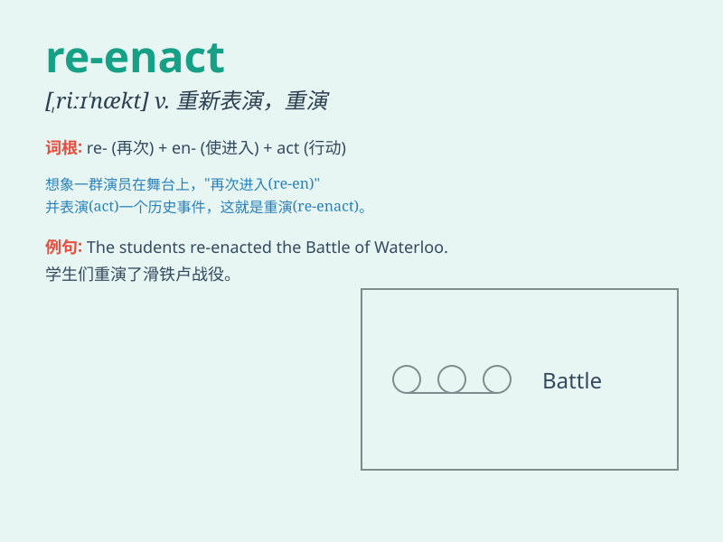

## re-enact

**英音:** _[,ri:ɪˈækt]_ **美音:** _[,ri:ɪˈækt]_

**译义:** *vt.重新表演,重新扮演;重新体验;重新实施;重新制定*

### 短语

+ **re-enact a scene:** _重新演绎一个场景_

+ **re-enact an event:** _重现一个事件_

+ **re-enact a battle:** _重演一场战斗_

+ **re-enact a drama:** _重新上演一部戏剧_

+ **re-enact a story:** _重新讲述一个故事_

### 例句

#### 例句1

> **The theater group plans to re-enact the famous play next
month.**

**中文翻译:** 这个剧团计划下个月重新上演那部著名的戏剧。

**单词释义:** 重新上演

#### 例句2

> **They decided to re-enact the battle scene for the historical
documentary.**

**中文翻译:** 他们决定为历史纪录片重新演绎那场战斗场景。

**单词释义:** 重新演绎

#### 例句3

> **The children love to re-enact the fairy tale in their own
way.**

**中文翻译:** 孩子们喜欢用他们自己的方式重新表演那个童话故事。

**单词释义:** 重新表演

### 背诵小故事

> A group of actors decided to re-enact the famous battle scene from
history. They practiced hard to repeat and show exactly how it happened
in the past. This helped them understand the event better.

**一群演员决定重新演绎历史上著名的战斗场景。他们努力排练，以精确重现过去发生的事情。这帮助他们更好地理解了这一事件。**

### 图义

