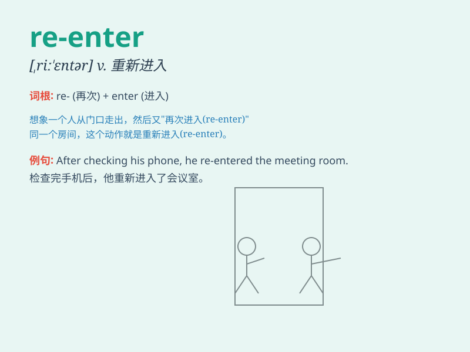

## re-enter

**英音:** _[ˌriːˈɛntə]_ **美音:** _[ˌriːˈɛntər]_

**译义:** *vt. 重新进入；再次加入 vi. 重新进入；再次加入*

### 短语

+ **re-enter school:** _重新入学_

+ **re-enter the workforce:** _重新进入劳动力市场_

+ **re-enter the building:** _重新进入大楼_

+ **re-enter the competition:** _重新参加比赛_

+ **re-enter the room:** _重新进入房间_

### 例句

#### 例句1

> **He had to re-enter the room to fetch his keys.**

**中文翻译:** 他不得不再次进入房间去取他的钥匙。

**单词释义:** 再次进入

#### 例句2

> **After a short break, she re-entered the competition with more
determination.**

**中文翻译:** 短暂休息后，她带着更多的决心重新参加比赛。

**单词释义:** 重新参加

#### 例句3

> **The data was lost, so they had to re-enter it all.**

**中文翻译:** 数据丢失了，所以他们不得不全部重新输入。

**单词释义:** 重新输入

### 背诵小故事

> One day, Tom left his house but forgot his keys. So he had to
re-enter the house to get them. Re-enter means to enter again.

**一天，汤姆离开了家但忘了带钥匙。所以他不得不再次进入房子去拿。re-enter
意思是再次进入。**

### 图义

