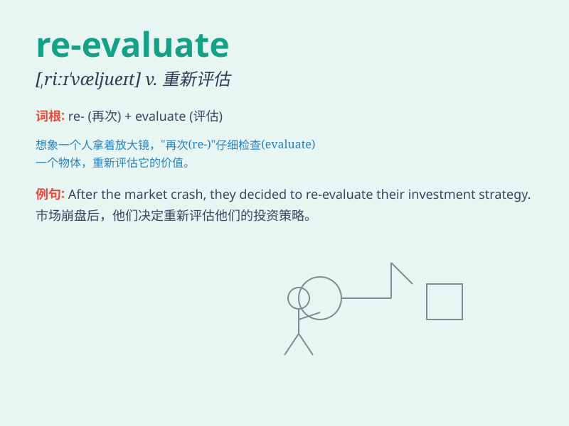

## re-evaluate

**英音:** _[ˌriːɪˈvæl.juː.ət]_ **美音:**
_[ˌriˈevˈæl.jə.ˌteɪt]_

**译义:** *重新评估，再评价*

### 短语

+ **re-evaluate the situation:** _重新评估形势_

+ **re-evaluate one\'s decisions:** _重新评估某人的决定_

+ **re-evaluate the project:** _重新评估项目_

+ **re-evaluate the plan:** _重新评估计划_

+ **re-evaluate the strategy:** _重新评估策略_

### 例句

#### 例句1

> **The company decided to re-evaluate its marketing strategy after
the poor sales performance.**

**中文翻译:** 在销售业绩不佳之后，公司决定重新评估其营销策略。

**单词释义:** 重新评估

#### 例句2

> **You should re-evaluate your goals at the beginning of each
year.**

**中文翻译:** 你应该在每年年初重新评估你的目标。

**单词释义:** 重新评估

#### 例句3

> **The doctor suggested that I re-evaluate my diet and exercise
routine.**

**中文翻译:** 医生建议我重新评估我的饮食和锻炼习惯。

**单词释义:** 重新评估

### 背诵小故事

> One day, Tom thought his plan was perfect. But later, new information
came. So, he had to re-evaluate it. He carefully considered all aspects
again to make a better decision.

**有一天，汤姆认为他的计划很完美。但后来，新的信息来了。所以，他不得不重新评估。他再次仔细考虑所有方面以做出更好的决定。**

### 图义

