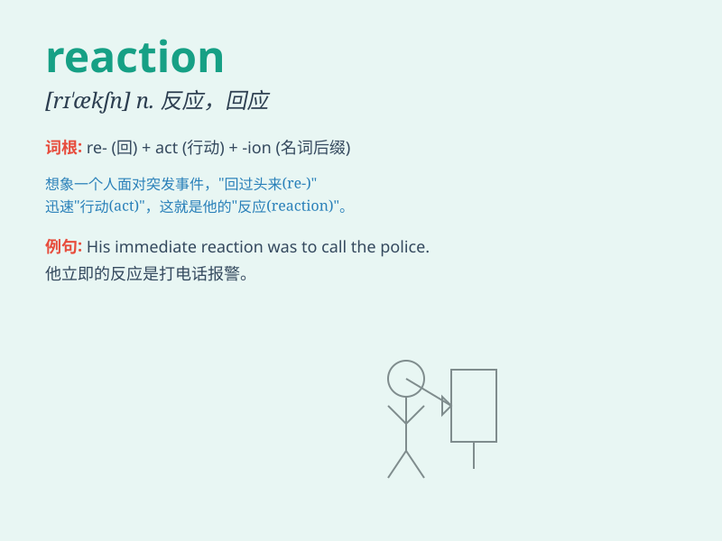

## reaction

**英音:** _[rɪ\'ækʃ(ə)n]_ **美音:** _[rɪ\'ækʃən]_

**译义:** *n.反应,反作用,反动(力)*

### 短语

+ **chemical reaction:** _化学反应_

+ **reaction time:** _反应时间_

+ **allergic reaction:** _过敏反应_

+ **chain reaction:** _连锁反应_

+ **reaction force:** _反作用力_

### 例句

#### 例句1

> **His reaction to the news was one of shock.**

**中文翻译:** 他对这个消息的反应是震惊。

**单词释义:** 反应

#### 例句2

> **The chemical reaction produced a new substance.**

**中文翻译:** 化学反应产生了新物质。

**单词释义:** 反应

#### 例句3

> **Her reaction was completely unexpected.**

**中文翻译:** 她的反应完全出乎她的意料。

**单词释义:** 反应

### 背诵小故事

> A scientist mixed two chemicals. Suddenly, there was a big change.
Bubbles rose and colors changed. This was a strong reaction. It showed
how things can change when combined.

**一位科学家混合了两种化学物质。突然，发生了巨大的变化。气泡升起，颜色改变。这是强烈的反应。它展示了东西结合时会如何变化。**

### 图义

