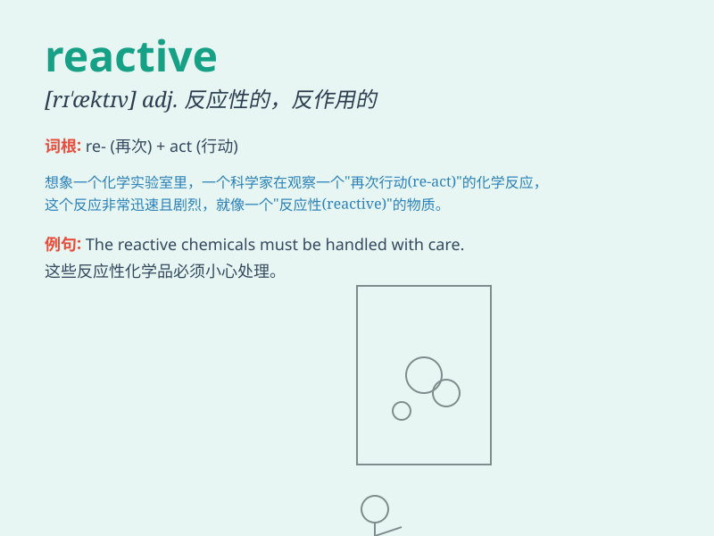

## reactive

**英音:** _[rɪ\'æktɪv]_ **美音:** _[rɪ\'æktɪv]_

**译义:** *adj.反应的,起反作用的,反动的,电抗性的*

### 短语

+ **reactive power:** _无功功率_

+ **reactive component:** _电抗成分；无功分量_

+ **reactive dye:** _活性染料_

+ **reactive arthritis:** _反应性关节炎_

+ **reactive current:** _无功电流_

### 例句

#### 例句1

> **The chemical is highly reactive and must be handled with
care.**

**中文翻译:** 该化学品具有高度反应性，必须小心处理。

**单词释义:** 反应性强的

#### 例句2

> **His reactive response surprised everyone.**

**中文翻译:** 他的反应让所有人都感到惊讶。

**单词释义:** 应激的

#### 例句3

> **The company\'s reactive approach to problems has led to
inefficiencies.**

**中文翻译:** 该公司对问题的反应性方法导致效率低下。

**单词释义:** 被动反应的

### 背诵小故事

> One day, a scientist was conducting experiments. The substances he
used were reactive, meaning they readily responded and changed when
exposed to certain conditions. This reactivity made his research both
challenging and exciting.

**有一天，一位科学家正在做实验。他使用的物质是有反应性的，这意味着当暴露在某些条件下时，它们很容易做出反应并发生变化。这种反应性使他的研究既具有挑战性又令人兴奋。**

### 图义

