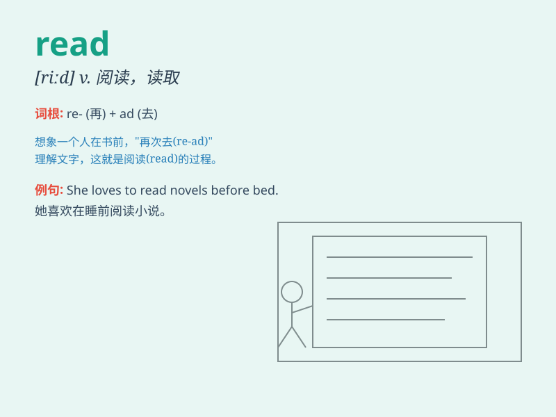

## read

**英音:** _[ri:d;red]_ **美音:** _[rid; rɛd]_

**译义:** *v.读,阅读,理解,学习adj.有学问的n.读取
vbl.read的过去式和过去分词*

### 短语

+ **read aloud:** _大声朗读_

+ **read between the lines:** _体会言外之意_

+ **read up on:** _研读，攻读_

+ **read out:** _大声读出_

+ **read over:** _仔细阅读_

### 例句

#### 例句1

> **I like to read books in my spare time.**

**中文翻译:** 我喜欢在业余时间看书。

**单词释义:** 阅读

#### 例句2

> **Can you read this letter for me?**

**中文翻译:** 你能为我读一下这封信吗？

**单词释义:** 朗读；读出

#### 例句3

> **The sign reads \'No Smoking\'.**

**中文翻译:** 标牌上写着"禁止吸烟"。

**单词释义:** 写着；显示

### 背诵小故事

> One day, a little boy was lost in a big library. He found a magic
book that could talk. The book said, \'Read me and you\'ll find the way
out!\' The boy read the book carefully and finally found his way home.

**有一天，一个小男孩在一个大图书馆里迷路了。他发现了一本会说话的魔法书。书说：'读我，你就能找到出去的路！'男孩认真地读了这本书，最终找到了回家的路。**

### 图义

