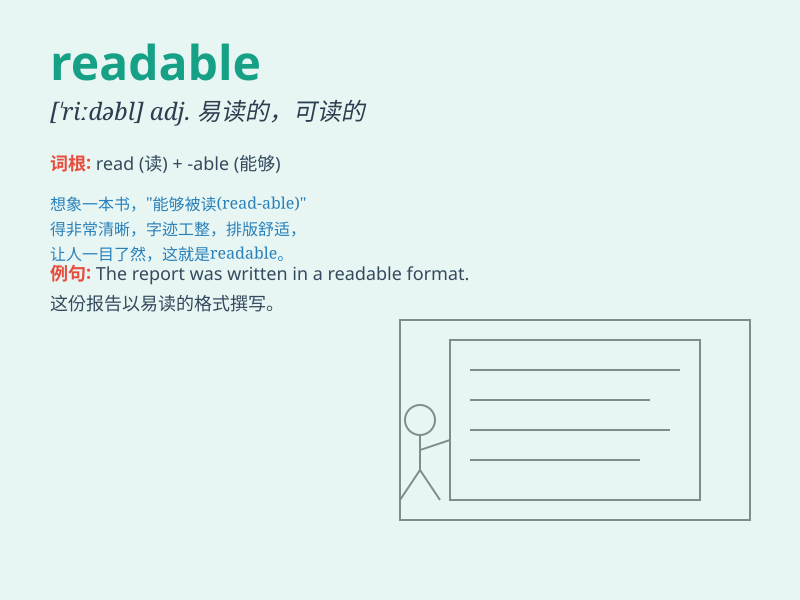

## readable

**英音:** _[\'riːdəb(ə)l]_ **美音:** _[\'ridəbl]_

**译义:** *adj.易读的*

### 短语

+ **readable copy:** _清晰可读的副本_

+ **readable format:** _可读格式_

+ **readable style:** _易读的风格_

+ **readable text:** _可读的文本_

+ **highly readable:** _非常易读_

### 例句

#### 例句1

> **This book is highly readable and engaging.**

**中文翻译:** 这本书具有很强的可读性和吸引力。

**单词释义:** 易读的

#### 例句2

> **The report was presented in a clear and readable format.**

**中文翻译:** 该报告以清晰易读的格式呈现。

**单词释义:** 易读的

#### 例句3

> **Her handwriting is quite readable compared to others\'.**

**中文翻译:** 与其他人相比，她的字迹非常可读。

**单词释义:** 清晰易读的

### 背诵小故事

> Once upon a time, a little boy found a book. The words in it were so
clear and easy that he could read them smoothly. He shouted excitedly,
\'This book is readable!\'

**从前，一个小男孩发现了一本书。书里的字非常清晰且容易，他能够顺利地读出来。他兴奋地喊道：'这本书容易读！'**

### 图义

