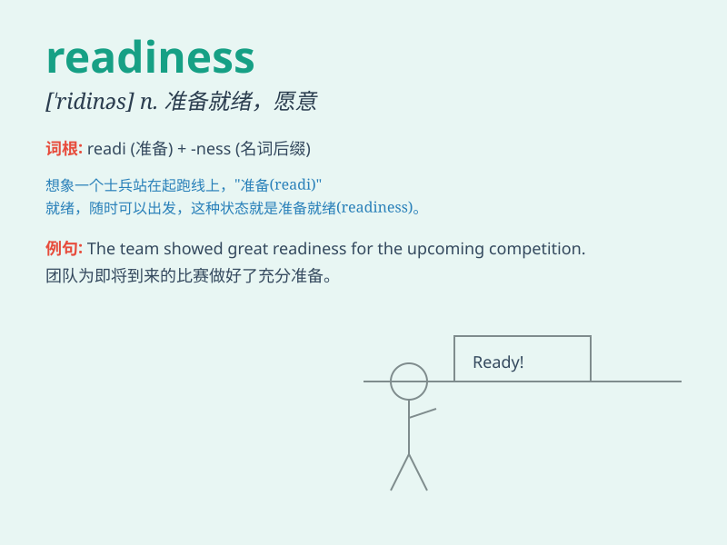

## readiness

**英音:** _[\'redɪnəs]_ **美音:** _[\'rɛdɪnəs]_

**译义:** *n.准备就绪*

### 短语

+ **readiness to act:** _行动的准备_

+ **readiness for emergency:** _应对紧急情况的准备_

+ **readiness of mind:** _思维的敏捷_

+ **readiness in response:** _回应的迅速_

+ **readiness to learn:** _学习的意愿_

### 例句

#### 例句1

> **The troops showed their readiness for battle.**

**中文翻译:** 部队表现出战斗准备。

**单词释义:** 准备就绪；愿意；准备好的状态

#### 例句2

> **Her readiness to help others is highly appreciated.**

**中文翻译:** 她乐于助人的精神受到高度赞赏。

**单词释义:** 愿意；乐意

#### 例句3

> **We are in a state of readiness to respond to any emergency.**

**中文翻译:** 我们已做好应对任何紧急情况的准备。

**单词释义:** 准备就绪

### 背诵小故事

> One day, a team was going on a dangerous adventure. Before setting
off, they checked their equipment and supplies to ensure their
readiness. Everyone was well-prepared and full of confidence.

**一天，一个团队要去进行一次危险的冒险。出发前，他们检查了设备和物资以确保做好准备。每个人都准备充分且充满信心。**

### 图义

