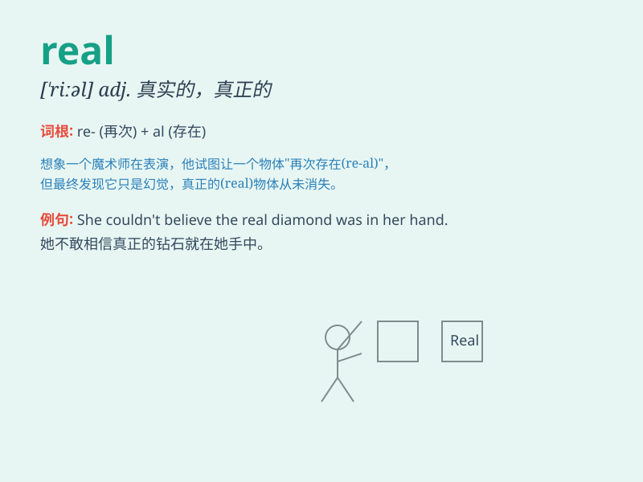

## real

**英音:** _[riːl]_ **美音:** _[\'riəl]_

**译义:** *adj.真的,真实的,不动产的*

### 短语

+ **real estate:** _房地产；不动产_

+ **real life:** _现实生活；实际生活_

+ **real name:** _真实姓名_

+ **real income:** _实际收入_

+ **real value:** _实际价值_

### 例句

#### 例句1

> **This is a real diamond.**

**中文翻译:** 这是一颗真正的钻石。

**单词释义:** 真正的；真实的

#### 例句2

> **The problem is real and we must face it.**

**中文翻译:** 问题是现实的，我们必须面对它。

**单词释义:** 真实的；实际的

#### 例句3

> **He had a real passion for music.**

**中文翻译:** 他对音乐充满热情。

**单词释义:** 真正的；名副其实的

### 背诵小故事

> A poor boy always dreamed of having real treasure. One day, he found
a hidden cave and inside was a chest filled with real gold and jewels.
He finally understood the meaning of real wealth.

**一个贫穷的男孩总是梦想拥有真正的宝藏。有一天，他发现了一个隐藏的洞穴，里面有一个装满真正的黄金和珠宝的箱子。他终于明白了真正财富的含义。**

### 图义

