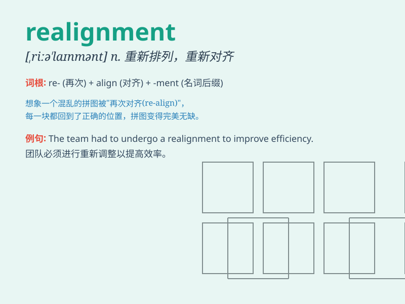

## realignment

**英音:** _[ˌriːəˈlaɪnmənt]_ **美音:**
_[ˌriːəˈlaɪnmənt]_

**译义:** *n.重新排列,再结盟*

### 短语

+ **economic realignment:** _经济调整_

+ **strategic realignment:** _战略调整_

+ **political realignment:** _政治重新组合_

+ **industry realignment:** _产业调整_

+ **market realignment:** _市场重新调整_

### 例句

#### 例句1

> **The company is undergoing a major realignment of its business
strategy.**

**中文翻译:** 该公司正在对其业务战略进行重大调整。

**单词释义:** 调整；重新组合

#### 例句2

> **The political realignment in the country has led to significant
changes.**

**中文翻译:** 该国的政治调整带来了重大变化。

**单词释义:** 重新组合；重新调整

#### 例句3

> **The realignment of the team was necessary to improve
performance.**

**中文翻译:** 为了提高绩效，有必要对团队进行重组。

**单词释义:** 重新调整；重新排列

### 背诵小故事

> A company was in chaos until a wise leader came and initiated a
realignment. Workers changed positions and new strategies were formed.
Finally, the company thrived. This shows how realignment can bring
positive change.

**一家公司陷入混乱，直到一位明智的领导者到来并启动了重新调整。员工们更换了职位，形成了新的策略。最终，公司蓬勃发展。这展示了重新调整如何能带来积极的变化。**

### 图义

