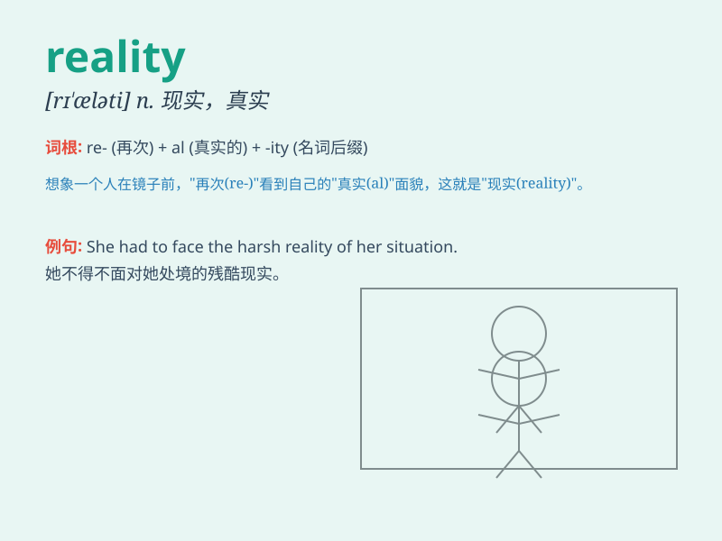

## reality

**英音:** _[rɪ\'ælɪtɪ]_ **美音:** _[rɪ\'æləti]_

**译义:** *n.真实,事实,本体,逼真*

### 短语

+ **in reality:** _实际上；事实上_

+ **reality show:** _真人秀；真实秀_

+ **face reality:** _面对现实_

+ **reality check:** _现实检查；认清现实_

+ **escape from reality:** _逃避现实_

### 例句

#### 例句1

> **The reality of the situation was much more complicated than we
thought.**

**中文翻译:** 现实情况比我们想象的要复杂得多。

**单词释义:** 实际情况；现实

#### 例句2

> **She had to face the harsh reality of losing her job.**

**中文翻译:** 她不得不面对失业的残酷现实。

**单词释义:** 现实

#### 例句3

> **In reality, he is not as brave as he appears.**

**中文翻译:** 事实上，他并不像表面上那么勇敢。

**单词释义:** 实际上；事实上

### 背诵小故事

> A young artist always dreamed of creating masterpieces. One day, he
faced many difficulties but didn\'t give up. Finally, his works were
shown in a big exhibition, and he realized the reality of his success.
It was not just a dream but a real achievement.

**一位年轻的艺术家总是梦想着创作杰作。有一天，他面临许多困难但没有放弃。最终，他的作品在一个大型展览中展出，他意识到了自己成功的现实。这不再只是一个梦，而是真正的成就。**

### 图义

