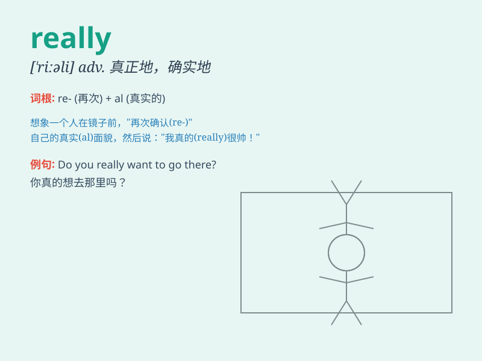

## really

**英音:** _[\'rɪəlɪ]_ **美音:** _[ˈriəˌli, ˈrili]_

**译义:** *adv.真正地,实在地,(表语气)真的吗?*

### 短语

+ **really good:** _非常好_

+ **really bad:** _非常坏_

+ **really hard:** _非常困难_

+ **really fast:** _非常快_

+ **really funny:** _非常有趣_

### 例句

#### 例句1

> **I\'m really happy today.**

**中文翻译:** 我今天真的很高兴。

**单词释义:** 真地，确实

#### 例句2

> **The movie was really interesting.**

**中文翻译:** 这部电影真的很有趣。

**单词释义:** 非常，很

#### 例句3

> **She doesn\'t really like coffee.**

**中文翻译:** 她其实不太喜欢咖啡。

**单词释义:** 实际上，事实上

### 背诵小故事

> One day, Tom was asked if he liked the new movie. He answered,
\'Really! I loved it very much.\' It means truly or in fact. So, when
you want to emphasize the truth, you can say \'really\'.

**一天，汤姆被问到是否喜欢新电影。他回答："真的！我非常喜欢。"这个词意思是真实地，事实上。所以当你想强调真实情况时，可以说"really"。**

### 图义

