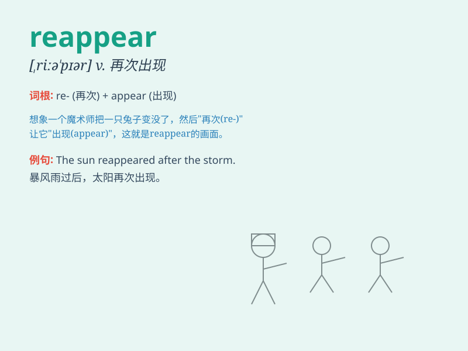

## reappear

**英音:** _[riːə\'pɪə]_ **美音:** _[,riə\'pɪr]_

**译义:** *vi.再出现*

### 短语

+ **reappear suddenly:** _突然再次出现_

+ **reappear unexpectedly:** _意外地重现_

+ **reappear gradually:** _逐渐再现_

+ **reappear frequently:** _频繁地再次出现_

+ **reappear rarely:** _很少再次出现_

### 例句

#### 例句1

> **The missing cat reappeared after three days.**

**中文翻译:** 三天后失踪的猫又出现了。

**单词释义:** 再次出现

#### 例句2

> **The old problem has reappeared and we need to solve it again.**

**中文翻译:** 老问题又出现了，需要重新解决。

**单词释义:** 重新出现

#### 例句3

> **The stars reappeared as the clouds cleared.**

**中文翻译:** 当云层散去时，星星重新出现。

**单词释义:** 再次显现

### 背诵小故事

> One day, a magical bird disappeared. But to everyone\'s surprise, it
reappeared after a storm. It flew back with shiny feathers, as if it had
gone on a secret adventure and returned to show us its tales.

**有一天，一只神奇的鸟消失了。但令所有人惊讶的是，一场暴风雨过后它又重新出现了。它带着闪亮的羽毛飞回来，仿佛去进行了一场秘密冒险然后回来给我们讲述它的故事。**

### 图义

