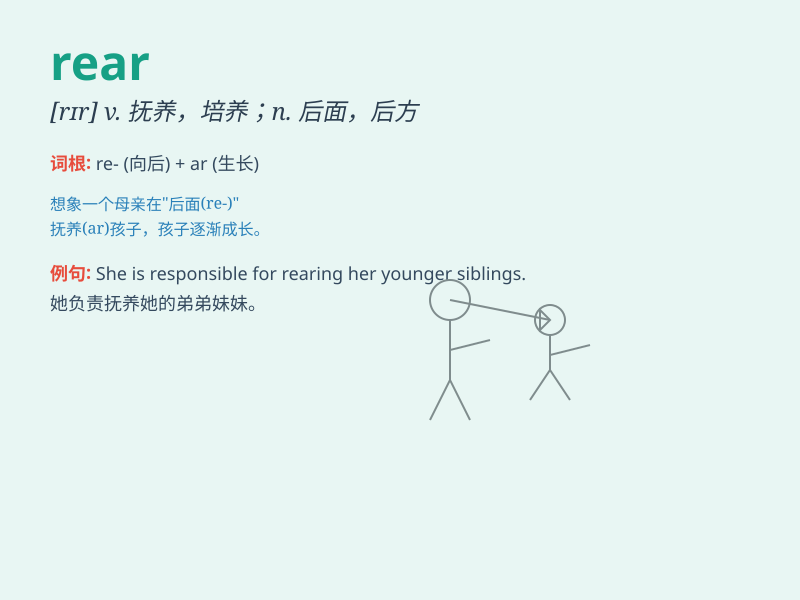

## rear

**英音:** _[rɪə]_ **美音:** _[rɪr]_

**译义:**
*n.后面,背后,后方,屁股adj.后面的,背面的,后方的vt.培养,饲养,举起,树立,栽种vi.高耸,暴跳,用后腿站起*

### 短语

+ **rear view:** _后视；后视图_

+ **rear seat:** _后座_

+ **rear end:** _后端；臀部_

+ **rear guard:** _后卫；殿后部队_

+ **rear children:** _抚养孩子_

### 例句

#### 例句1

> **The horse reared up in fright.**

**中文翻译:** 马受惊直立起来。

**单词释义:** 直立

#### 例句2

> **She was looking after the rearing of young children.**

**中文翻译:** 她负责照顾年幼的孩子。

**单词释义:** 抚养

#### 例句3

> **The enemy attacked our rear.**

**中文翻译:** 敌人攻击我们的后方。

**单词释义:** 后方

### 背诵小故事

>
想象一下，在一个农场里，有一群小鸡。农夫站在农场的后方（rear）照顾它们。突然，一只老鹰从前方飞来，农夫赶紧跑到后方保护小鸡。所以
rear 就是'后方，背部'的意思。

**想象在农场里，农夫在小鸡群的后方保护它们，以此记住 rear
表示'后方，背部'。**

### 图义

