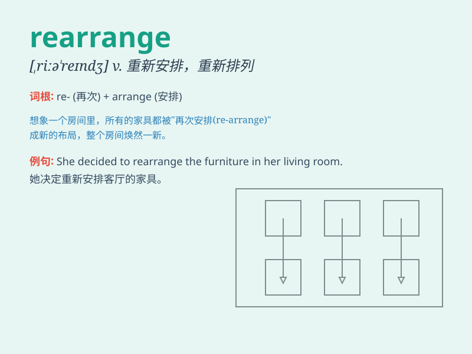

## rearrange

**英音:** _[riːə\'reɪn(d)ʒ]_ **美音:** _[,riə\'rendʒ]_

**译义:** *vt.再排列,重新整理*

### 短语

+ **rearrange furniture:** _重新布置家具_

+ **rearrange schedule:** _重新安排日程_

+ **rearrange thoughts:** _重新整理思路_

+ **rearrange books:** _重新整理书籍_

+ **rearrange flowers:** _重新摆放鲜花_

### 例句

#### 例句1

> **I need to rearrange the furniture in my living room.**

**中文翻译:** 我需要重新布置客厅里的家具。

**单词释义:** 重新安排；重新布置

#### 例句2

> **The teacher asked us to rearrange the sentences to make a
coherent paragraph.**

**中文翻译:** 老师要求我们重新排列句子，组成一个连贯的段落。

**单词释义:** 重新排列

#### 例句3

> **She had to rearrange her schedule due to the unexpected
meeting.**

**中文翻译:** 由于这次意外的会面，她不得不重新安排日程。

**单词释义:** 重新安排

### 背诵小故事

> A little monkey was playing with its toys. But they were all messed
up. So, it decided to rearrange them neatly. It moved the blocks here
and the balls there, making everything organized again.

**一只小猴子在玩它的玩具。但它们都乱了。所以，它决定重新整理它们。它把积木移到这里，球移到那里，让一切再次变得有条理。**

### 图义

