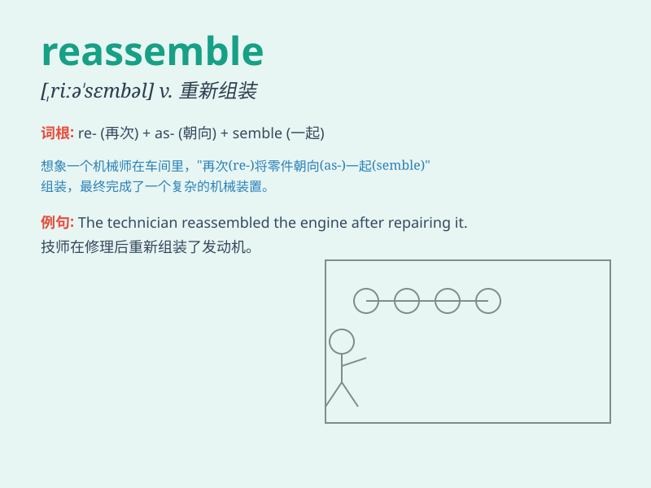

## reassemble

**英音:** _[riːə\'semb(ə)l]_ **美音:** _[,riə\'sɛmbl]_

**译义:** *vt.重新召集vi.重新集合*

### 短语

+ **reassemble parts:** _重新组装零件_

+ **reassemble the team:** _重新组建团队_

+ **reassemble furniture:** _重新装配家具_

+ **reassemble machinery:** _重新装配机器_

+ **reassemble components:** _重新组装部件_

### 例句

#### 例句1

> **We need to reassemble the machine after maintenance.**

**中文翻译:** 维修后我们需要重新组装机器。

**单词释义:** 重新组装

#### 例句2

> **The team will reassemble at the conference room at 2 p.m.**

**中文翻译:** 团队将于下午 2 点在会议室重新集合。

**单词释义:** 重新集合

#### 例句3

> **It took them a long time to reassemble the broken vase.**

**中文翻译:** 他们花了很长时间才把破碎的花瓶重新组装起来。

**单词释义:** 重新拼凑

### 背诵小故事

> Imagine a robot that was taken apart. But then, its parts were
brought back together again. This process of putting the robot\'s pieces
back together is like \'reassemble\'.

**想象一个机器人被拆开了。但随后，它的零件又被重新组合到一起。这个把机器人零件重新组合的过程就像是'reassemble'（重新装配）。**

### 图义

