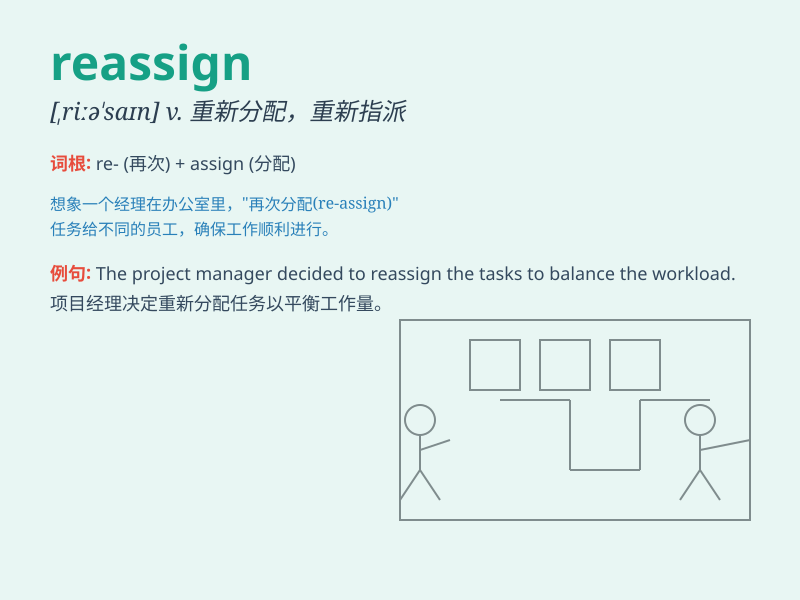

## reassign

**英音:** _[riːə\'saɪn]_ **美音:** _[\'riə\'saɪn]_

**译义:** *vt.再分配,再指定*

### 短语

+ **reassign work:** _重新分配工作_

+ **reassign tasks:** _重新分配任务_

+ **reassign responsibility:** _重新分配责任_

+ **reassign personnel:** _重新调配人员_

+ **reassign position:** _重新安排职位_

### 例句

#### 例句1

> **The manager decided to reassign the project to a more experienced
team.**

**中文翻译:** 经理决定将项目重新分配给更有经验的团队。

**单词释义:** 重新分配

#### 例句2

> **Due to staff changes, they had to reassign the tasks.**

**中文翻译:** 由于人员变动，他们不得不重新分配任务。

**单词释义:** 重新分配

#### 例句3

> **The teacher will reassign the seats in the classroom next
week.**

**中文翻译:** 下周老师将重新分配教室的座位。

**单词释义:** 重新安排

### 背诵小故事

> A company needed to reassign tasks. John\'s original job was changed.
He was not sad but saw it as a new chance. Reassign means to give a new
assignment or task to someone.

**一家公司需要重新分配任务。约翰原本的工作被改变了。他并不难过，而是将其视为新的机会。reassign
意思是给某人新的任务或工作分配。**

### 图义

