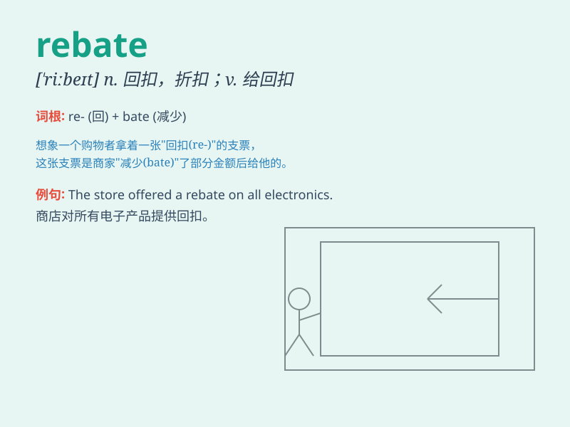

## rebate

**英音:** _[\'riːbeɪt]_ **美音:** _[\'ribet]_

**译义:** *n.回扣,折扣vt.减少,打折扣vi.给\...回扣,打折扣*

### 短语

+ **tax rebate:** _税收回扣；税收减免_

+ **cash rebate:** _现金回扣_

+ **rebate coupon:** _折扣券；回扣券_

+ **purchase rebate:** _购买回扣_

+ **interest rebate:** _利息回扣_

### 例句

#### 例句1

> **You may be eligible for a rebate on your purchase.**

**中文翻译:** 您可能有资格获得购买折扣。

**单词释义:** 退款；折扣

#### 例句2

> **The company offered a rebate to customers who bought in bulk.**

**中文翻译:** 该公司向批量购买的顾客提供折扣。

**单词释义:** 折扣

#### 例句3

> **I received a rebate check in the mail for my recent
energy-efficient appliance purchase.**

**中文翻译:** 我最近购买了节能电器，收到了一张邮寄的回扣支票。

**单词释义:** 退款

### 背诵小故事

> A poor man was always struggling to make ends meet. One day, he
bought a costly item but was lucky to get a rebate. With that money
back, he could finally buy some food for his family. The rebate saved
the day!

**一个穷人总是入不敷出。有一天，他买了一件昂贵的东西，但幸运地得到了回扣。用这笔退款，他终于能为家人买些食物了。回扣拯救了这一天！**

### 图义

