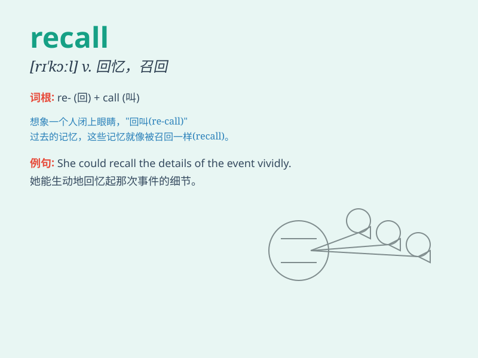

## recall

**英音:** _[rɪ\'kɔːl]_ **美音:** _[\'rikɔl]_

**译义:** *vt.回忆,回想,记起,取消n.召回*

### 短语

+ **beyond recall:** _无法挽回；不可恢复_

+ **recall to mind:** _想起；回忆起_

+ **recall from:** _从\...召回_

+ **have a good recall:** _记忆力好_

+ **recall notice:** _召回通知_

### 例句

#### 例句1

> **I can\'t recall his name at the moment.**

**中文翻译:** 我现在记不起他的名字了。

**单词释义:** 想起，回忆起

#### 例句2

> **The smell of the sea recalled memories of her childhood.**

**中文翻译:** 大海的味道勾起了她童年的回忆。

**单词释义:** 唤起，引起

#### 例句3

> **The company decided to recall the defective products.**

**中文翻译:** 该公司决定召回缺陷产品。

**单词释义:** 召回，收回

### 背诵小故事

> I lost my keys and was very worried. Suddenly, I recalled that I left
them on the table in the living room. With this memory, I found my keys
easily. Recall means to remember something that happened in the past.

**我丢了钥匙，非常担心。突然，我回想起我把它们落在客厅的桌子上了。凭借这个回忆，我轻松地找到了钥匙。recall
意思是记起过去发生的事。**

### 图义

