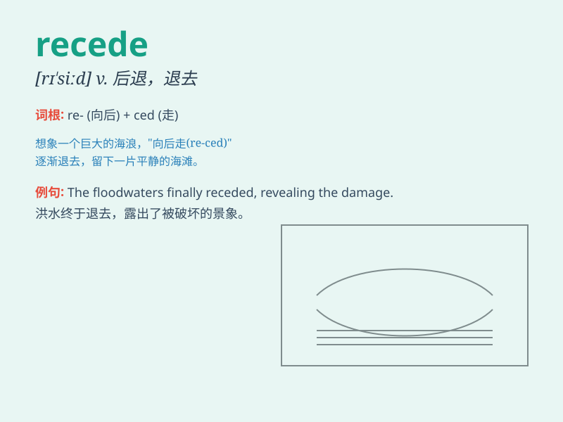

## recede

**英音:** _[rɪ\'siːd]_ **美音:** _[rɪ\'sid]_

**译义:** *v.后退*

### 短语

+ **recede from:** _从\...\...后退；从\...\...撤回_

+ **recede into the background:** _退居幕后；变得不那么重要_

+ **recede gradually:** _逐渐后退；逐渐消退_

+ **recede far away:** _退得很远_

+ **recede in memory:** _在记忆中渐渐淡去_

### 例句

#### 例句1

> **The floodwaters gradually receded.**

**中文翻译:** 洪水逐渐退去。

**单词释义:** 后退；消退

#### 例句2

> **His enthusiasm for the project receded as time went on.**

**中文翻译:** 随着时间的推移，他对这个项目的热情逐渐消退。

**单词释义:** 减弱；衰退

#### 例句3

> **The coastline recedes as the sea level rises.**

**中文翻译:** 随着海平面上升，海岸线后退。

**单词释义:** 后退；退缩

### 背诵小故事

> A brave explorer was walking along the coast. As the tide receded, it
revealed hidden treasures. The word \'recede\' means to move back or
withdraw, just like the tide moving away from the shore.

**一位勇敢的探险家沿着海岸行走。随着潮水退去，它露出了隐藏的宝藏。单词\'recede\'的意思是后退或撤回，就像潮水从岸边退去一样。**

### 图义

