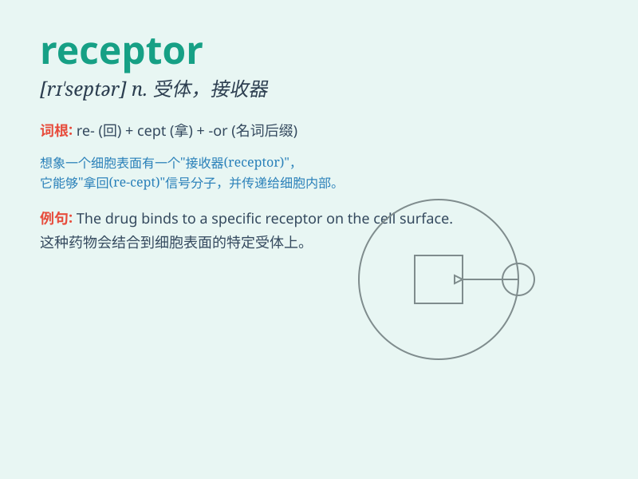

## receptor

**英音:** _[rɪ\'septə]_ **美音:** _[rɪ\'sɛptɚ]_

**译义:** *n.接受器,感受器,受体*

### 短语

+ **receptor site:** _受体部位_

+ **hormone receptor:** _激素受体_

+ **cell receptor:** _细胞受体_

+ **receptor molecule:** _受体分子_

+ **neurotransmitter receptor:** _神经递质受体_

### 例句

#### 例句1

> **The receptor on the cell surface binds to the hormone.**

**中文翻译:** 细胞表面的受体与激素结合。

**单词释义:** 受体

#### 例句2

> **Nerve receptors respond to different types of stimuli.**

**中文翻译:** 神经受体对不同类型的刺激做出反应。

**单词释义:** 受体

#### 例句3

> **The drug interacts with the receptor to produce a therapeutic
effect.**

**中文翻译:** 药物与受体相互作用产生治疗作用。

**单词释义:** 受体

### 背诵小故事

> Imagine a little robot in a science lab. It has special arms to catch
and hold signals. This robot is like a receptor, always ready to receive
and respond to the information sent to it.

**想象一个科学实验室里的小机器人。它有特殊的手臂来捕捉和握住信号。这个机器人就像一个受体，总是准备好接收并响应发送给它的信息。**

### 图义

