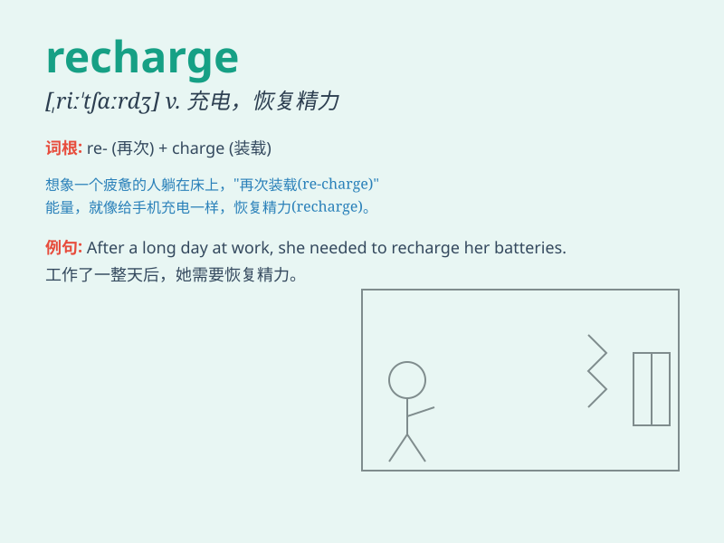

## recharge

**英音:** _[ˌriːˈtʃɑːdʒ]_ **美音:** _[ˌriːˈtʃɑːrdʒ]_

**译义:** *vt.再充电,再控告,再袭击vi.再袭击n.再袭击,再装填*

### 短语

+ **recharge one\'s batteries:** _养精蓄锐；休整_

+ **rechargeable battery:** _可充电电池_

+ **recharge the atmosphere:** _给大气补充能量_

+ **recharge a credit card:** _给信用卡充值_

+ **recharge a phone:** _给手机充电_

### 例句

#### 例句1

> **I need to recharge my phone battery.**

**中文翻译:** 我需要给手机电池充电。

**单词释义:** 给\...\...充电

#### 例句2

> **After a long day of work, I need to recharge my energy.**

**中文翻译:** 经过一整天的工作后，我需要补充能量。

**单词释义:** 恢复（精力等）

#### 例句3

> **The solar panels recharge the batteries during the day.**

**中文翻译:** 太阳能电池板在白天为电池充电。

**单词释义:** 给\...\...充电

### 背诵小故事

> A tired traveler was lost in a desert. His phone battery was dying.
Luckily, he found a solar charger and was able to recharge it. With a
charged phone, he finally found his way out.

**一位疲惫的旅行者在沙漠中迷路了。他的手机电池快没电了。幸运的是，他找到了一个太阳能充电器，能够给手机充电。手机充好电后，他终于找到了出路。**

### 图义

