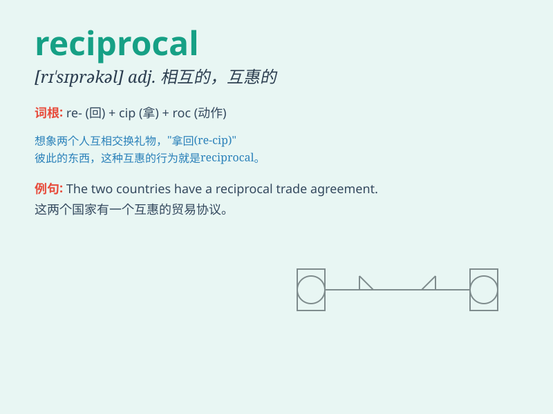

## reciprocal

**英音:** _[rɪ\'sɪprək(ə)l]_ **美音:** _[rɪ\'sɪprəkl]_

**译义:**
*adj.互惠的,相应的,倒数的,彼此相反的n.倒数,互相起作用的事物*

### 短语

+ **reciprocal relationship:** _相互关系_

+ **reciprocal trade:** _互惠贸易_

+ **reciprocal promise:** _相互承诺_

+ **reciprocal agreement:** _互惠协定_

+ **reciprocal action:** _相互作用；交互动作_

### 例句

#### 例句1

> **The two countries have a reciprocal trade agreement.**

**中文翻译:** 两国有互惠贸易协定。

**单词释义:** 互惠的；相互的

#### 例句2

> **Reciprocal love is the most beautiful thing.**

**中文翻译:** 相互的爱是最美好的事情。

**单词释义:** 相互的

#### 例句3

> **Their relationship is based on reciprocal respect.**

**中文翻译:** 他们的关系建立在相互尊重的基础上。

**单词释义:** 相互的；互惠的

### 背诵小故事

> Once upon a time, two friends always gave each other gifts. Their
actions were reciprocal. It means they responded to each other in the
same way. Just like this, remember \'reciprocal\' means mutual and given
in return.

**从前，两个朋友总是互赠礼物。他们的行为是相互的。这意味着他们以相同的方式回应对方。就像这样，记住'reciprocal'意思是相互的、互惠的。**

### 图义

