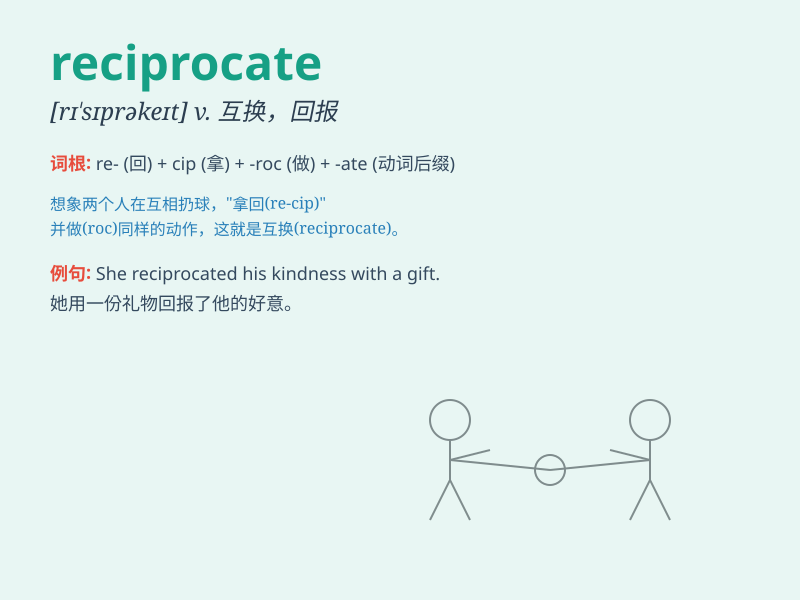

## reciprocate

**英音:** _[rɪ\'sɪprəkeɪt]_ **美音:** _[rɪ\'sɪprəket]_

**译义:** *v.互给,酬答,互换,报答*

### 短语

+ **reciprocate kindness:** _回报善意_

+ **reciprocate love:** _回应爱_

+ **reciprocate friendship:** _回报友谊_

+ **reciprocate efforts:** _回报努力_

+ **reciprocate hospitality:** _回报殷勤款待_

### 例句

#### 例句1

> **He always reciprocates kindness with kindness.**

**中文翻译:** 他总是以善报德。

**单词释义:** 回报；报答

#### 例句2

> **She didn\'t reciprocate his love.**

**中文翻译:** 她没有回报他的爱。

**单词释义:** 回应；回报

#### 例句3

> **We hope that our efforts will be reciprocated by better
cooperation from them.**

**中文翻译:** 我们希望我们的努力能够得到他们更好的合作的回报。

**单词释义:** 回报；回应

### 背诵小故事

> A boy always gave gifts to a girl. One day, the girl decided to
reciprocate by giving him a nice watch. It means to do something in
return, just like the girl did.

**一个男孩总是送礼物给一个女孩。有一天，女孩决定回赠给他一块漂亮的手表。这意味着作为回报做某事，就像这个女孩所做的那样。**

### 图义

