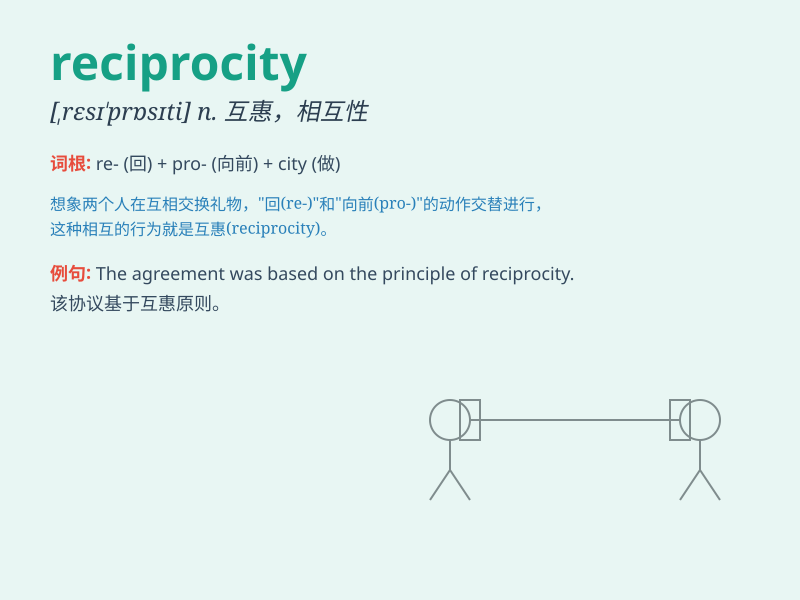

## reciprocity

**英音:** _[,resɪ\'prɒsɪtɪ]_ **美音:**
_[,rɛsɪ\'prɑsəti]_

**译义:** *n.互惠*

### 短语

+ **reciprocity principle:** _互惠原则_

+ **mutual reciprocity:** _相互互惠_

+ **reciprocity agreement:** _互惠协定_

+ **commercial reciprocity:** _商业互惠_

+ **reciprocity relationship:** _互惠关系_

### 例句

#### 例句1

> **Reciprocity is the foundation of a healthy relationship.**

**中文翻译:** 互惠是健康关系的基础。

**单词释义:** 互惠；相互性

#### 例句2

> **The principle of reciprocity governs international trade.**

**中文翻译:** 国际贸易遵循互惠原则。

**单词释义:** 互惠原则

#### 例句3

> **They showed no reciprocity in their dealings with us.**

**中文翻译:** 他们在与我们打交道时没有表现出互惠互利。

**单词释义:** 互惠；相互回报

### 背诵小故事

> Imagine two friends, Tom and Jerry. Tom gives Jerry a gift, and Jerry
responds by giving Tom one too. This back-and-forth exchange of gifts
shows reciprocity. It\'s like a mutual give and take.

**想象一下两个朋友，汤姆和杰瑞。汤姆给杰瑞一个礼物，杰瑞也回赠汤姆一个。这种你来我往的礼物交换体现了互惠。就像是相互的给予和接受。**

### 图义

