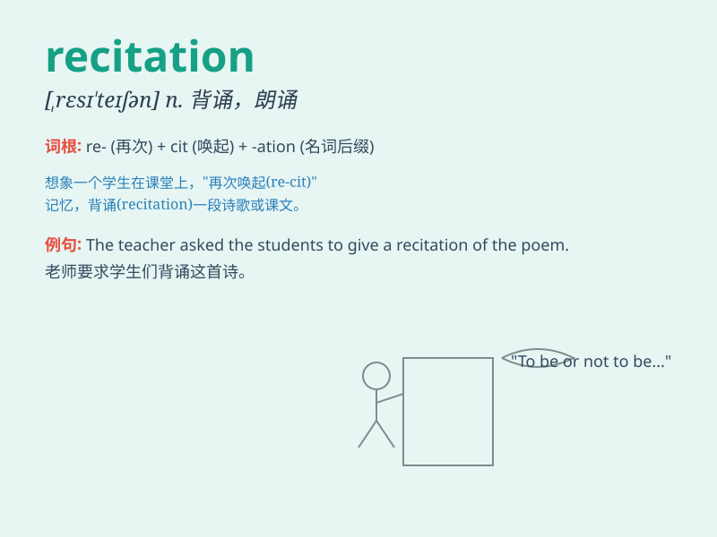

## recitation

**英音:** _[,resɪ\'teɪʃ(ə)n]_ **美音:** _[,rɛsɪ\'teʃən]_

**译义:** *n.朗诵,背诵,叙述,背诵的东西*

### 短语

+ **recitation contest:** _朗诵比赛_

+ **recitation session:** _朗诵会_

+ **poetry recitation:** _诗歌朗诵_

+ **recitation performance:** _朗诵表演_

+ **class recitation:** _课堂背诵_

### 例句

#### 例句1

> **The student\'s recitation of the poem was flawless.**

**中文翻译:** 学生对这首诗的背诵毫无瑕疵。

**单词释义:** 朗诵；背诵

#### 例句2

> **The recitation competition attracted many participants.**

**中文翻译:** 朗诵比赛吸引了众多参赛者。

**单词释义:** 朗诵；背诵

#### 例句3

> **She prepared well for the recitation of the historical text.**

**中文翻译:** 她为历史课文的背诵做好了充分的准备。

**单词释义:** 背诵

### 背诵小故事

> 小明在课堂上参加 recitation
活动，他紧张地背诵着诗歌。老师表扬他的表现，说这是一次很棒的朗诵。小明明白了
recitation 就是公开地、有感情地背诵或朗读。

**小明在课堂上参加朗诵活动，老师表扬他，让他明白了 recitation
是公开地、有感情地背诵或朗读。**

### 图义

