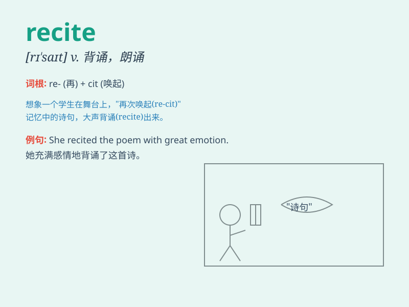

## recite

**英音:** _[rɪ\'saɪt]_ **美音:** _[rɪ\'saɪt]_

**译义:** *v.背诵,朗读,叙述,[律]书面陈述(事实)*

### 短语

+ **recite a poem:** _背诵一首诗_

+ **recite a passage:** _背诵一段文章_

+ **recite by heart:** _凭记忆背诵_

+ **recite aloud:** _大声背诵_

+ **recite fluently:** _流利地背诵_

### 例句

#### 例句1

> **The student was asked to recite the poem in class.**

**中文翻译:** 学生被要求在课堂上背诵这首诗。

**单词释义:** 背诵

#### 例句2

> **She can recite the entire play from memory.**

**中文翻译:** 她能背诵整出戏。

**单词释义:** 背诵

#### 例句3

> **The actor had to recite his lines perfectly for the
performance.**

**中文翻译:** 演员必须完美地背诵台词才能表演。

**单词释义:** 背诵

### 背诵小故事

> 小明参加朗诵比赛，他反复练习，recite
着优美的诗篇。比赛时，他在台上流畅地 recite
出准备的内容，最终赢得了掌声。记住小明 recite
诗歌的场景，就能记住这个单词是背诵、朗诵的意思啦。

**小明参加朗诵比赛，反复练习背诵优美的诗篇。比赛时在台上流畅背诵出准备的内容并赢得掌声。记住这个场景，就能记住
recite 是背诵、朗诵的意思。**

### 图义

