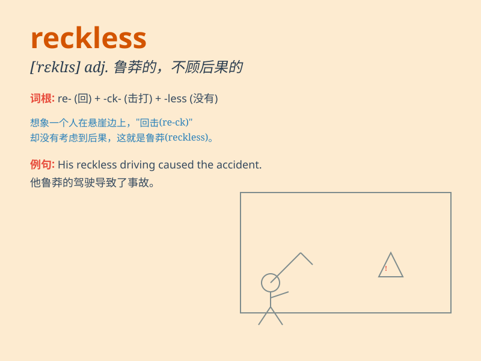

## reckless

**英音:** _[\'reklɪs]_ **美音:** _[\'rɛkləs]_

**译义:** *adj.不计后果的*

### 短语

+ **reckless driving:** _鲁莽驾驶_

+ **reckless behavior:** _鲁莽的行为_

+ **reckless abandon:** _不顾一切；肆意放纵_

+ **reckless spending:** _乱花钱；挥霍_

+ **reckless disregard:** _全然不顾；毫不理会_

### 例句

#### 例句1

> **He drove at a reckless speed, endangering his life and
others\'.**

**中文翻译:** 他超速驾驶，危及自己和他人的生命。

**单词释义:** 鲁莽的，不计后果的（形容他开车的方式）

#### 例句2

> **Her reckless spending led her into debt.**

**中文翻译:** 她不计后果的消费导致她负债累累。

**单词释义:** 轻率的，不顾后果的（形容她花钱的行为）

#### 例句3

> **The reckless actions of the soldiers caused a diplomatic
incident.**

**中文翻译:** 士兵们的鲁莽行为引发了一场外交事件。

**单词释义:** 鲁莽的，不计后果的（形容士兵的行为）

### 背诵小故事

> A reckless driver was speeding on the road. He didn\'t care about
traffic rules and almost caused an accident. His recklessness put many
lives in danger.

**一个鲁莽的司机在路上超速行驶。他不在乎交通规则，差点造成事故。他的鲁莽将许多生命置于危险之中。**

### 图义

