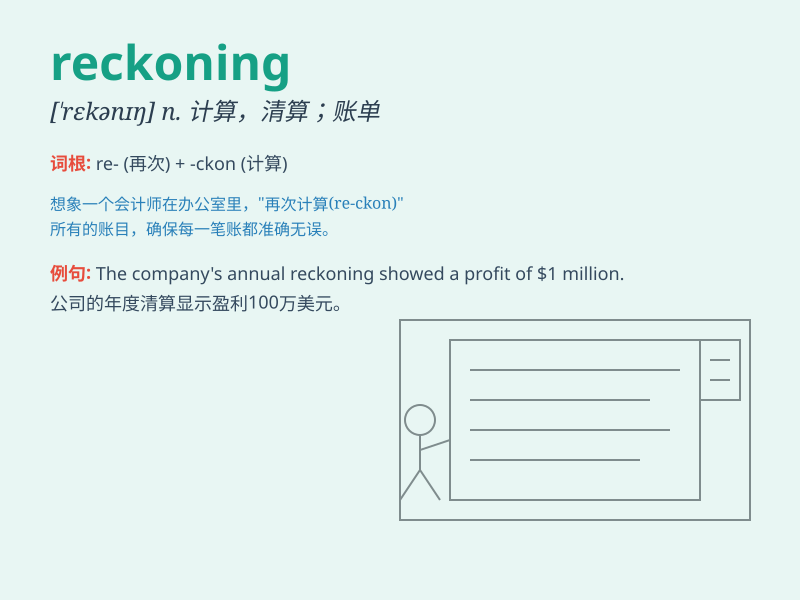

## reckoning

**英音:** _[\'rek(ə)nɪŋ]_ **美音:** _[\'rɛkənɪŋ]_

**译义:** *n.计算,帐单,算帐,结帐,清算,估计*

### 短语

+ **day of reckoning:** _清算日；报应来临的日子_

+ **in reckoning:** _在计算中；在考虑中_

+ **without reckoning:** _未计算在内；不考虑_

+ **reckoning up:** _计算；结算_

+ **by my reckoning:** _据我估计；依我看_

### 例句

#### 例句1

> **In the reckoning of history, this event was a turning point.**

**中文翻译:** 从历史的角度来看，这一事件是一个转折点。

**单词释义:** 计算；估计

#### 例句2

> **The day of reckoning has come for those who have committed
crimes.**

**中文翻译:** 对于那些犯下罪行的人来说，清算的日子已经到来。

**单词释义:** 清算；算总账

#### 例句3

> **By my reckoning, we should arrive at the destination by noon.**

**中文翻译:** 据我估计，中午时分我们应该就可以到达目的地了。

**单词释义:** 估计；认为

### 背诵小故事

> A brave adventurer was lost in a mysterious forest. He knew that
reckoning, the moment of judgment for his choices, was coming. If he
didn\'t find the right way out, it would be a disaster. But with
determination, he finally found the exit.

**一位勇敢的探险家在神秘森林中迷路了。他知道清算，也就是对他选择的评判时刻即将到来。如果找不到正确的出路，那将是一场灾难。但凭借决心，他最终找到了出口。**

### 图义

