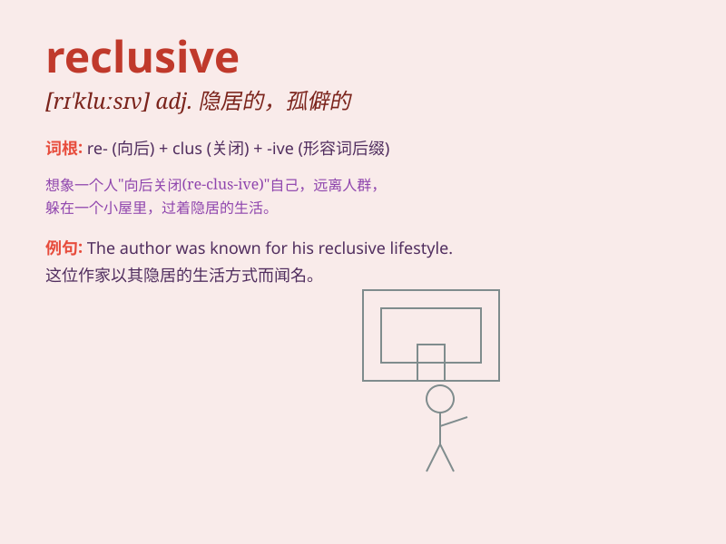

## reclusive

**英音:** _[rɪ\'kluːsɪv]_ **美音:** _[rɪ\'klʊsɪv]_

**译义:** *adj.隐遁的,隐居的*

### 短语

+ **reclusive lifestyle:** _隐居的生活方式_

+ **reclusive nature:** _隐居的天性_

+ **become reclusive:** _变得隐居_

+ **lead a reclusive life:** _过隐居生活_

+ **reclusive habits:** _隐居的习惯_

### 例句

#### 例句1

> **He has become increasingly reclusive since his wife\'s death.**

**中文翻译:** 自从妻子去世后，他变得越来越孤僻。

**单词释义:** 孤僻的；隐居的

#### 例句2

> **The reclusive writer spent most of her time alone in her
cabin.**

**中文翻译:** 这位隐居的作家大部分时间都独自待在自己的小屋里。

**单词释义:** 隐居的

#### 例句3

> **She led a reclusive life, avoiding social gatherings.**

**中文翻译:** 她过着隐居的生活，避免社交聚会。

**单词释义:** 隐居的；不爱社交的

### 背诵小故事

> A hermit lived in a reclusive cabin deep in the forest. He avoided
contact with others, enjoying the solitude. One day, a lost traveler
knocked on his door. The hermit, though reluctant, showed kindness. This
encounter made him question his reclusive life.

**一位隐士住在森林深处一个与世隔绝的小屋里。他避免与他人接触，享受着孤独。一天，一个迷路的旅行者敲响了他的门。隐士虽不情愿，但还是表现出了善意。这次相遇让他对自己的隐居生活产生了质疑。**

### 图义

