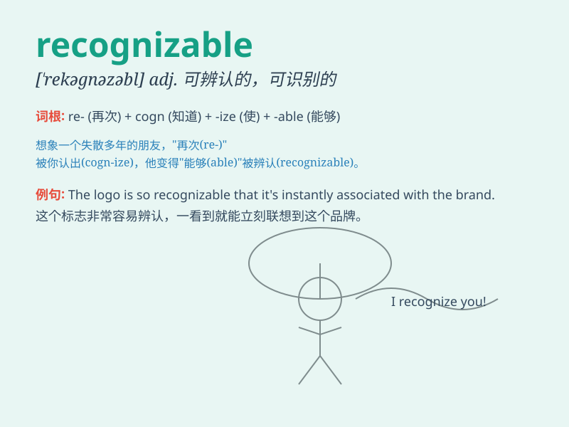

## recognizable

**英音:** _[ˈrekəɡnaɪzəbl]_ **美音:** _[ˈrekəɡnaɪzəbl]_

**译义:** *adj.可认识的,可辨认的,可公认的,可认知的*

### 短语

+ **recognizable pattern:** _可识别的模式_

+ **recognizable feature:** _可辨认的特征_

+ **recognizable face:** _可识别的脸_

+ **recognizable voice:** _可辨认的声音_

+ **recognizable sign:** _可识别的标志_

### 例句

#### 例句1

> **The logo of the company is highly recognizable.**

**中文翻译:** 公司的标志辨识度很高。

**单词释义:** 可识别的；容易认出的

#### 例句2

> **Her voice was still recognizable despite the years.**

**中文翻译:** 尽管已经过去了很多年，但她的声音依然清晰可辨。

**单词释义:** 可辨认的；能认出的

#### 例句3

> **The style of his paintings is easily recognizable.**

**中文翻译:** 他的绘画风格很容易辨认。

**单词释义:** 容易识别的

### 背诵小故事

> A detective was looking for a recognizable thief. The thief had a
unique scar on his face. With this recognizable feature, the detective
finally caught him.

**一位侦探正在寻找一个容易辨认的小偷。这个小偷脸上有一道独特的伤疤。凭借这个容易辨认的特征，侦探最终抓住了他。**

### 图义

