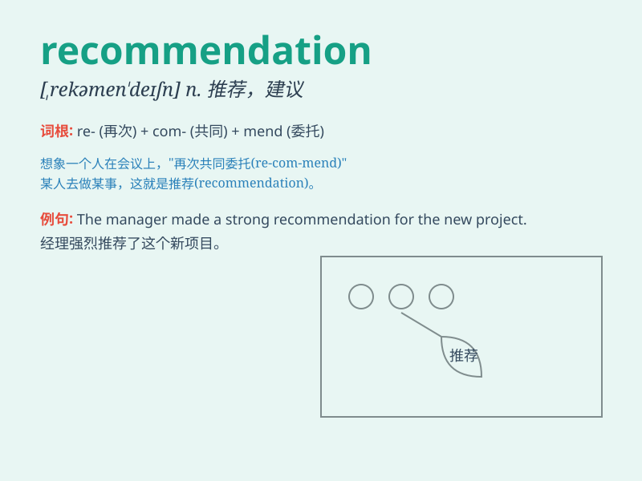

## recommendation

**英音:** _[,rekəmen\'deɪʃ(ə)n]_ **美音:**
_[,rɛkəmɛn\'deʃən]_

**译义:** *n.推荐,介绍(信),劝告,建议*

### 短语

+ **make a recommendation:** _提出建议_

+ **follow a recommendation:** _遵循建议_

+ **recommendation letter:** _推荐信_

+ **professional recommendation:** _专业推荐_

+ **strong recommendation:** _强烈推荐_

### 例句

#### 例句1

> **I received a recommendation from my professor to read this
book.**

**中文翻译:** 我收到了教授的推荐来阅读这本书。

**单词释义:** 推荐；建议

#### 例句2

> **The doctor\'s recommendation was to get more exercise and eat a
balanced diet.**

**中文翻译:** 医生的建议是多锻炼、均衡饮食。

**单词释义:** 建议；劝告

#### 例句3

> **We followed her recommendation and had a wonderful vacation.**

**中文翻译:** 我们听从了她的推荐，度过了一个愉快的假期。

**单词释义:** 推荐；介绍

### 背诵小故事

> One day, Tom was confused about which movie to watch. His friend gave
him a recommendation and said, \'I suggest you watch this one. It\'s
amazing!\' Tom followed the recommendation and had a great time.

**有一天，汤姆不知道该看哪部电影。他的朋友给了他一个推荐并说："我建议你看这部。它太棒了！"汤姆听从了这个推荐，度过了愉快的时光。**

### 图义

