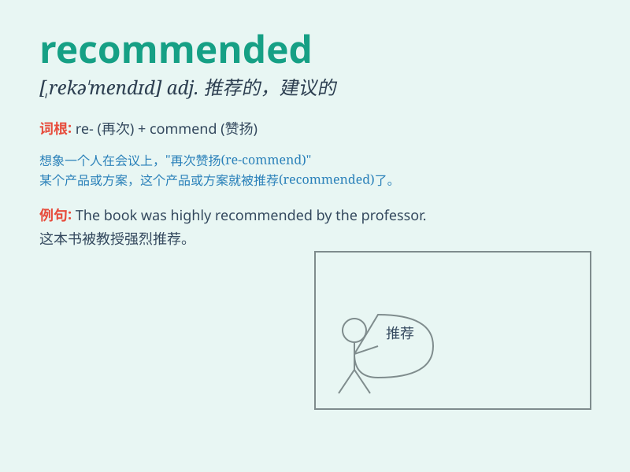

## recommended

**英音:** _[,rekə\'mendɪd]_ **美音:** _[,rɛkə\'mɛndɪd]_

**译义:** *被推荐的*

### 短语

+ **recommended dosage:** _推荐剂量_

+ **recommended practice:** _推荐做法_

+ **highly recommended:** _强烈推荐_

+ **recommended reading:** _推荐读物_

+ **recommended measures:** _推荐措施_

### 例句

#### 例句1

> **The doctor recommended that I get more exercise.**

**中文翻译:** 医生建议我多运动。

**单词释义:** 建议

#### 例句2

> **This book is highly recommended by many readers.**

**中文翻译:** 这本书受到许多读者的强烈推荐。

**单词释义:** 推荐

#### 例句3

> **The travel agency recommended several scenic spots to us.**

**中文翻译:** 旅行社给我们推荐了几个景点。

**单词释义:** 推荐

### 背诵小故事

> One day, I was lost in a new city. A kind local recommended a
wonderful restaurant to me. I followed the recommendation and had a
delicious meal. It made me remember the word\'recommended\' easily.

**有一天，我在一个新城市迷路了。一位友善的当地人向我推荐了一家很棒的餐厅。我听从了这个推荐，享用了一顿美味的饭菜。这让我轻松记住了\'recommended\'这个单词。**

### 图义

