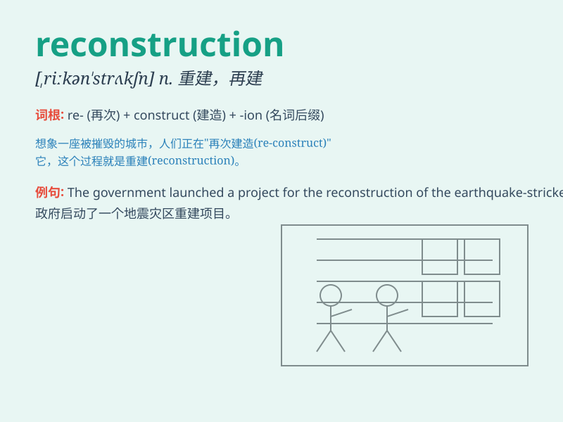

## reconstruction

**英音:** _[riːkən\'strʌkʃn]_ **美音:**
_[,rikən\'strʌkʃən]_

**译义:** *n.重建,改造*

### 短语

+ **post-war reconstruction:** _战后重建_

+ **urban reconstruction:** _城市重建_

+ **reconstruction project:** _重建项目_

+ **economic reconstruction:** _经济重建_

+ **reconstruction work:** _重建工作_

### 例句

#### 例句1

> **The reconstruction of the city after the earthquake was a huge
undertaking.**

**中文翻译:** 地震后城市的重建是一项艰巨的任务。

**单词释义:** 重建

#### 例句2

> **The historian is studying the reconstruction of ancient
civilizations.**

**中文翻译:** 历史学家正在研究古代文明的重建。

**单词释义:** 重建

#### 例句3

> **The economic reconstruction of the country requires the efforts
of the whole society.**

**中文翻译:** 国家的经济重建需要全社会的努力。

**单词释义:** 重建

### 背诵小故事

> After the earthquake, the town was in ruins. But with everyone\'s
efforts, the reconstruction began. Workers built new houses and roads.
Eventually, the town was restored to its former beauty.

**地震过后，小镇一片废墟。但在大家的努力下，重建工作开始了。工人们建造了新的房屋和道路。最终，小镇恢复了往日的美丽。**

### 图义

