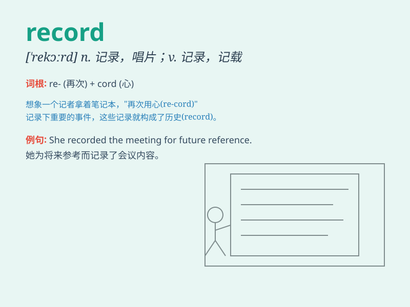

## record

**英音:** _[(for v.)rɪˈkɔːd; (for n.) ˈrekɔːd]_ **美音:**
_[(for v.) rɪˈkɔrd; (for n.) ˈrekərd;ˈrɛkɚd]_

**译义:**
*n.履历,档案,诉状,最高纪录,报告,唱片vt.记录,标明,将\...录音vi.录音,被录音adj.创纪录的*

### 短语

+ **keep a record:** _做记录_

+ **break a record:** _打破纪录_

+ **set a record:** _创造纪录_

+ **on record:** _记录在案的；公开发表的_

+ **off the record:** _非正式的；私下的；不供发表的_

### 例句

#### 例句1

> **The doctor recorded the patient\'s symptoms in the medical
record.**

**中文翻译:** 医生将病人的症状记录在病历中。

**单词释义:** 记录

#### 例句2

> **She holds the world record for the long jump.**

**中文翻译:** 她保持着跳远世界纪录。

**单词释义:** 纪录

#### 例句3

> **The band\'s new album has sold a record number of copies.**

**中文翻译:** 乐队的新专辑销量创下了纪录。

**单词释义:** 创纪录的

### 背诵小故事

>
想象一下，你是一位勇敢的探险家，每到一个新地方就用本子写下所见所闻，这就是在做'record'（记录）。就像探险家记录冒险历程一样，我们用各种方式记录生活中的重要事情。

**想象一下，你是一位勇敢的探险家，每到一个新地方就用本子写下所见所闻，这就是在做'记录'。就像探险家记录冒险历程一样，我们用各种方式记录生活中的重要事情。**

### 图义

