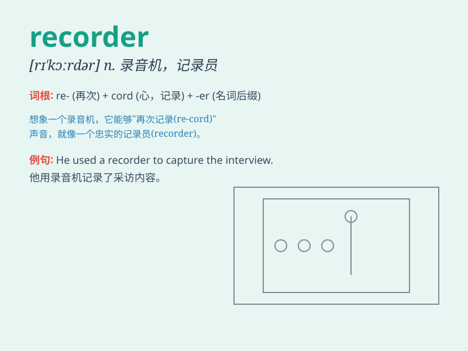

## recorder

**英音:** _[rɪ\'kɔːdə]_ **美音:** _[rɪ\'kɔrdɚ]_

**译义:** *n.记录员,录音[像]机n.[计] 宏录制器,记录器*

### 短语

+ **tape recorder:** _磁带录音机_

+ **video recorder:** _录像机_

+ **data recorder:** _数据记录器_

+ **flight recorder:** _飞行记录仪_

+ **sound recorder:** _录音机；录音工具_

### 例句

#### 例句1

> **She played a beautiful melody on the recorder.**

**中文翻译:** 她用竖笛演奏出优美的旋律。

**单词释义:** 竖笛；直笛

#### 例句2

> **The recorder captured every word of the meeting.**

**中文翻译:** 录音机记录了会议的每一句话。

**单词释义:** 录音机；录像机

#### 例句3

> **The data recorder showed abnormal readings.**

**中文翻译:** 数据记录仪显示读数异常。

**单词释义:** 记录器；记录设备

### 背诵小故事

> A little rabbit wanted to record its beautiful singing. So, it found
a recorder and started singing into it. The recorder captured the lovely
voice. Now, whenever the rabbit misses its singing, it plays the
recorder.

**一只小兔子想记录它美妙的歌声。于是，它找了一个录音机，对着它开始唱歌。录音机录下了这可爱的声音。现在，每当兔子想念自己的歌声，它就播放录音机。**

### 图义

