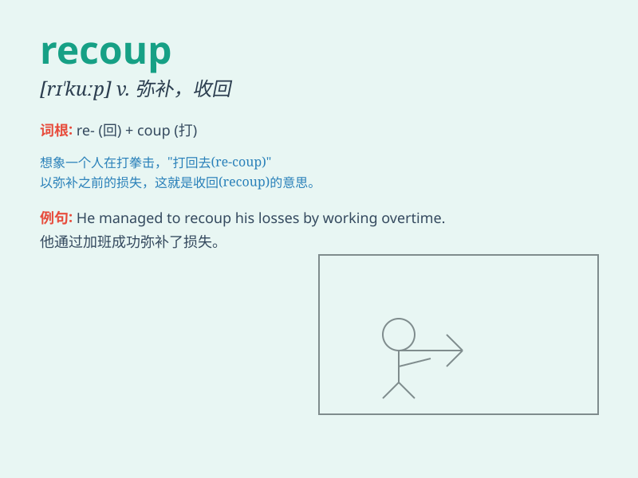

## recoup

**英音:** _[rɪˈkuːp]_ **美音:** _[rɪˈkuːp]_

**译义:** *vt.赔偿,补偿,扣除vi.补偿损失*

### 短语

+ **recoup losses:** _弥补损失_

+ **recoup expenses:** _收回开支_

+ **recoup one\'s investment:** _收回投资_

+ **recoup the cost:** _收回成本_

+ **recoup one\'s strength:** _恢复体力_

### 例句

#### 例句1

> **The company managed to recoup its losses within a year.**

**中文翻译:** 该公司在一年之内就挽回了亏损。

**单词释义:** 弥补；补偿

#### 例句2

> **She hopes to recoup the money she spent on the dress by selling
it.**

**中文翻译:** 她希望通过出售这件衣服来收回买这件衣服的钱。

**单词释义:** 收回（成本）

#### 例句3

> **After the lawsuit, he was able to recoup his damages.**

**中文翻译:** 诉讼结束后，他成功挽回了损失。

**单词释义:** 挽回；索回

### 背诵小故事

> A poor merchant lost a lot of money. But he was determined to recoup
his losses. He worked hard, found new opportunities, and finally
regained all the money he had lost.

**一个贫穷的商人损失了很多钱。但他决心弥补损失。他努力工作，找到了新的机会，最终收回了他失去的所有钱。**

### 图义

