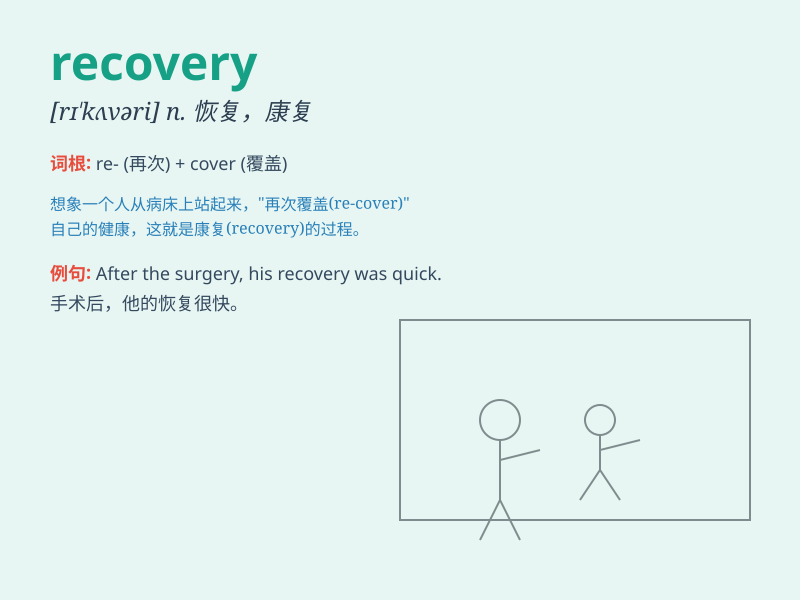

## recovery

**英音:** _[rɪ\'kʌv(ə)rɪ]_ **美音:** _[rɪ\'kʌvəri]_

**译义:** *n.恢复,痊愈,防御*

### 短语

+ **recovery room:** _康复室；恢复室_

+ **recovery time:** _恢复时间；复原时间_

+ **economic recovery:** _经济复苏；经济恢复_

+ **recovery rate:** _回收率；恢复率_

+ **recovery process:** _恢复过程；回收过程_

### 例句

#### 例句1

> **The patient made a remarkable recovery after the surgery.**

**中文翻译:** 手术后，病人恢复得非常好。

**单词释义:** 恢复；康复

#### 例句2

> **The economy is showing signs of recovery.**

**中文翻译:** 经济呈现复苏迹象。

**单词释义:** 复苏；好转

#### 例句3

> **The team is working hard for the recovery of the lost data.**

**中文翻译:** 该团队正在努力恢复丢失的数据。

**单词释义:** 找回；寻回

### 背诵小故事

> A brave athlete was seriously injured. But with strong will and
continuous efforts, he finally made a recovery. He could run and play
sports again, showing that recovery means getting better after being ill
or hurt.

**一位勇敢的运动员受了重伤。但凭借坚强的意志和持续的努力，他最终康复了。他又能跑步和运动了，这表明
recovery 意味着在生病或受伤后好转。**

### 图义

